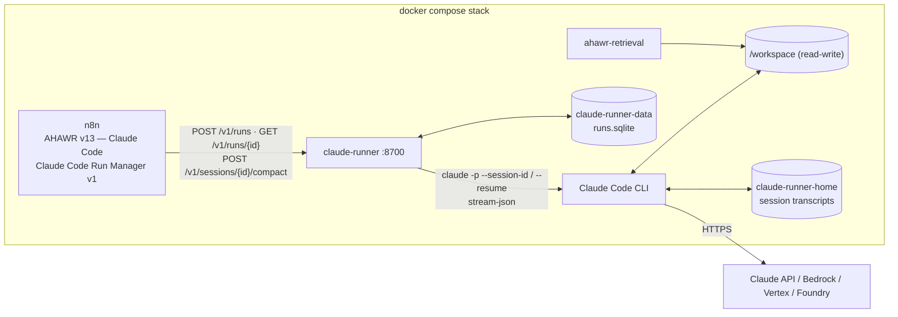

# claude-runner — AHAWR on Claude Code

**English** | [Русский](#русский)

`claude-runner` lets AHAWR use **Claude Code instead of Hermes** as the execution engine for the Architect, Worker and Reviewer. Claude Code has no HTTP run API of its own. It is a CLI (and the Agent SDK wraps the same CLI). This service runs it headless (`claude -p --output-format stream-json`) behind the **same `/v1/runs` contract the Hermes gateway exposes**. As a result, the AHAWR orchestration (polling, retries, run/session persistence in Data Tables, recovery) keeps working unchanged.



## Can n8n drive Claude Code the way it drives Hermes?

Yes, with one difference: Hermes is a server, and Claude Code is a process. The options checked were:

| Option | Verdict |
|---|---|
| Claude Code CLI headless (`claude -p`, `--output-format stream-json`, `--session-id`, `--resume`, `--permission-mode`, `--allowedTools`/`--disallowedTools`) | **Used.** Gives a session id, the final result, cost/usage, typed errors and resumable sessions. `/compact` also works non-interactively. |
| Claude Agent SDK (Python/TypeScript) | The same CLI as a library. It adds nothing needed here, so the runner calls the CLI directly. |
| n8n *Execute Command* running `claude -p` inside the n8n container | Blocks an n8n execution for the whole run, and it loses the run/poll/resume model. It would also give the agent n8n's container and credentials. |
| n8n community nodes (`n8n-nodes-claudecode` and others) | Third-party, the same blocking model, and they do not fit the existing Run Manager contract. |
| Claude Code routines `/fire` API, cloud sessions | Run in Anthropic's cloud against a GitHub repository, not against the local workspace, and there is no result/poll API for AHAWR. |
| Managed Agents (Claude API) | Hosted agent loop in a cloud sandbox. It does not see the local workspace and is a different product surface. |

## API (Hermes-compatible)

| Endpoint | Behaviour |
|---|---|
| `POST /v1/runs` `{input, model, provider, session_id?, working_directory?, role?}` | Starts a Claude Code turn asynchronously → `{run_id, session_id, status: "queued"\|"running"}`. With a `session_id` the saved session is resumed. If that session already has a run in flight, the same run is returned (`attached: true`), so there are never two concurrent turns in one session. |
| `GET /v1/runs/{run_id}` | `{status: queued\|running\|completed\|failed\|cancelled, output, error: {code, message}, http_code, session_id, cost_usd, num_turns, context_tokens, permission_denials}` |
| `POST /v1/runs/{run_id}/cancel` | Interrupts the turn (SIGINT). The session stays resumable. |
| `POST /v1/sessions/{session_id}/compact` `{mode?: auto\|always\|off}` | Runs Claude Code's `/compact` on the saved session when its context exceeds `CLAUDE_RUNNER_COMPACT_MIN_TOKENS` → `completed` / `skipped` (with `reason`) / `failed`. This replaces the Hermes TUI WebSocket compression. |
| `GET /v1/sessions/{session_id}`, `GET /health` | Session binding and context size; CLI version, auth mode, run counts. |
| `GET /v1/runs?role=&status=&session_id=&limit=`, `GET /v1/runs/{run_id}/events?after=N` | Read-only run list and each run's activity (the dashboard's data, see below). |

**Sessions.** The `session_id` AHAWR stores is the Claude Code session UUID. An id Claude Code does not know (for example one left over from Hermes in the Data Table) is bound to a fresh Claude Code session. The caller keeps its id and gets `session_created: true`. Transcripts live in the `claude-runner-home` volume, so sessions survive restarts and rebuilds.

**Failures map onto the Run Manager's rules:**

| Failure | Mapping | Run Manager result |
|---|---|---|
| Rate or usage limits | `rate_limit`, `http_code: 429` | Retried with the configured delays |
| API overload | `overloaded`, `http_code: 529` | Retried |
| Upstream 5xx | `server_error`, with the upstream status | Retried |
| Run timeout | `timeout`, `http_code: 408` | Retried |
| Unknown model, `max_turns`, `max_budget`, CLI errors | Code set, `http_code` not set | Permanent failure |
| Run interrupted by a runner restart or shutdown | `404 run_not_found` | The saved session is resumed with `resume_input` |

## Role profiles (Claude Code permissions)

| Role | Default permission mode | Denied tools |
|---|---|---|
| `worker` | `bypassPermissions` (edits, commands) | `Read(./.env)`, `Read(./.env.*)`, `Read(**/.env)`, `Read(**/.env.*)`, `Bash(git commit *)`, `Bash(git push *)` |
| `reviewer` | `dontAsk` (reads, read-only commands) | `Edit`, `Write`, `NotebookEdit`, and the `.env` reads |
| `architect` | `dontAsk` | `Edit`, `Write`, `NotebookEdit`, and the `.env` reads |

Override any of these per role with `CLAUDE_RUNNER_<ROLE>_PERMISSION_MODE`, `_ALLOWED_TOOLS`, `_DISALLOWED_TOOLS`, `_APPEND_SYSTEM_PROMPT` and `_MAX_TURNS`. Deny rules are enforced even in `bypassPermissions`: a real run confirmed that the Worker could not read `.env`. Claude Code refuses `bypassPermissions` as root, which is why the container runs as the `node` user. The Worker can still reach environment variables through Bash, so give the container only the model credential. `CLAUDE_RUNNER_*` values, including the runner's own API key, are removed from the CLI's environment.

## Setup

1. In `.env` next to `docker-compose.yml`, set `AHAWR_WORKSPACE_DIR` and **one** model credential:
   * `ANTHROPIC_API_KEY` — a Claude Console key, billed per use. This is the recommended option for unattended automation.
   * `CLAUDE_CODE_OAUTH_TOKEN` — a one-year token from `claude setup-token` for Pro/Max/Team/Enterprise plans. Personal automation only: Anthropic does not allow offering claude.ai login or subscription limits in products built for others.
   * Bedrock, Vertex or Foundry — their `CLAUDE_CODE_USE_*` variables.
2. Optionally pin the CLI version with `CLAUDE_CODE_VERSION`. Add the build tools your project needs to `CLAUDE_RUNNER_EXTRA_APT_PACKAGES`, because the Worker runs your tests inside this container.
3. Build and start the whole stack (n8n, ahawr-retrieval, claude-runner, litellm):

   ```powershell
   docker compose up -d --build     # builds and starts every container of the stack
   docker compose exec claude-runner curl -s http://127.0.0.1:8700/health
   ```

4. In n8n:
   * import `Claude_Code_Run_Manager_v1.json`, then `AHAWR_v13_ClaudeCode.json`;
   * no n8n credential is needed: the Run Manager's HTTP nodes send `Authorization: Bearer <hermes_config.runner_api_key>` only when that column is set. Leave both `CLAUDE_RUNNER_API_KEY` and `runner_api_key` empty (the run API has no host port), or set both to the same value;
   * copy the Run Manager's workflow id from its URL (`/workflow/<id>`) into `hermes_config.run_manager_workflow_id` of the `claude-code` row. When the column is empty, `nhjwX1G7FiVTO2Ah` is used. The Start nodes need no editing: their inputs come from the `Build … Run Input` Code nodes, and the Run Manager accepts them as they are.
5. Add the `runner_url` column and the `claude-code` row from `hermes_config.csv` to the `hermes_config` Data Table. Models are Claude Code aliases (`opus`, `sonnet`, `haiku`) or full model names. Missions keep their `state_namespace`; give Claude Code runs their own namespace if the Hermes version runs the same missions.

The Hermes workflows (`AHAWR_v13.json`, `Hermes_Run_Manager_v5.json`) are untouched. Both variants can be imported side by side, since they have different workflow ids.

## Mission working directories

The `working_directory` column of the `missions` Data Table (e.g. `D:\OpenAIProjects\job-searching-assistant`, `D:\ClaudeProjects\...`) chooses the project:

* The drive (`AHAWR_HOST_DRIVE`, default `D:\`) is mounted at `/d`: read-write for claude-runner, read-only for ahawr-retrieval. `CLAUDE_RUNNER_PATH_MAP` and `RETRIEVAL_PATH_MAP` map a mission's Windows path onto that mount.
* Architect, Worker and Reviewer run in that folder.
* The folder is also written into the prompts as `WORKING DIRECTORY: D:\… (shell: /d/…)`: into the mission text for the Architect and Reviewer, and at the top of each Worker task. Plans and reviews therefore use the real paths. The shell form equals the path inside the container, because drive D: is mounted at `/d`, and it also matches Git Bash/MSYS on Windows.
* Retrieval uses a corpus named after the path (`d-openaiprojects-job-searching-assistant`). It is indexed from that folder on first use and synced on every later request. `missions.retrieval_corpora_json` still overrides the corpus list.
* Missions without `working_directory` (`Null`) run in `/workspace` with the `hermes_config` corpora, as before.
* A folder that does not exist fails the run visibly (`invalid_working_directory`).

Give missions of different projects different `state_namespace` values. The Worker can reach the whole mounted drive. To narrow that, replace the drive mount in `docker-compose.yml` by bind mounts of the project folders at the matching `/d/...` paths.

## Dashboard: watch the agents work

Open **http://localhost:8701** (host port `AHAWR_DASHBOARD_PORT`). This is the equivalent of watching a Hermes session: every Architect, Worker and Reviewer run is listed newest first. Each run shows, as it happens:

* the model's thinking;
* its answers;
* every tool call (Bash command, file read, edit as a diff, TodoWrite list, subagent) and its result;
* API retries, context compaction, the final result with turns, cost and duration, and errors with the CLI's stderr.

A dashed box streams the block being generated token by token. Clicking the session id shows all runs of that session, for example the Architect's conversation across a mission.

It works the same for every provider, because it reads Claude Code's own event stream (`stream-json`), not a provider API:

* **Anthropic:** thinking arrives as Claude's thinking blocks.
* **Local llama.cpp or a third-party model behind LiteLLM** (OpenRouter and others): the model's `reasoning_content` reaches Claude Code as thinking blocks. `CLAUDE_CODE_DISABLE_THINKING=1` does not hide it; it only stops Claude Code from requesting extended thinking.

A model that returns no reasoning shows only answers and tool calls.

* **Read-only.** The dashboard port cannot start, cancel or compact runs, and the run API (8700) stays unpublished. It is published on `127.0.0.1` only, and it answers only to the host names in `CLAUDE_RUNNER_DASHBOARD_HOSTS`, which guards against DNS rebinding. It shows prompts, code and command output, so do not publish it more widely.
* **Storage.** Activity is kept in `/data/events/<run_id>.jsonl` in the `claude-runner-data` volume for `CLAUDE_RUNNER_EVENT_RETENTION_DAYS` days (default 14). Tool results are clipped to 20k characters per entry.
* **Live tokens.** `CLAUDE_RUNNER_LIVE_TOKENS=false` turns off the token stream (`--include-partial-messages`); finished blocks still appear.
* **Hermes runs** are not shown here: this dashboard covers the runs that go through claude-runner.

## Providers per role (like Hermes): Claude and a local llama.cpp model

Every run carries the role's `provider` from `hermes_config` (`architect_provider`, `worker_provider`, `reviewer_provider`), exactly as with Hermes. claude-runner looks up a provider block `CLAUDE_RUNNER_PROVIDER_<NAME>__<VARIABLE>` (note the double `_`):

* **No block for the provider** (e.g. `anthropic`): the run uses the container credential (`ANTHROPIC_API_KEY` or `CLAUDE_CODE_OAUTH_TOKEN`) and goes to Anthropic directly.
* **A block exists** (e.g. `local`): its variables are set for that run only. If the block sets an endpoint or credential (`ANTHROPIC_BASE_URL`, `ANTHROPIC_AUTH_TOKEN`, ...), the container's Anthropic credentials are removed from that run, so a local Worker never sees your subscription token. `TOOLS` and `COMPACT_MIN_TOKENS` in a block configure the runner for that provider.

```
Architect  provider=anthropic ─┐
Reviewer   provider=anthropic ─┼─ claude-runner ──CLAUDE_CODE_OAUTH_TOKEN──▶ Anthropic
Worker     provider=local ─────┘        └──ANTHROPIC_BASE_URL=http://litellm:4000──▶ litellm ──OpenAI API──▶ llama-server (host :8080)
```

Claude Code speaks only the Anthropic Messages API, while llama.cpp's `llama-server` is OpenAI-compatible. The `litellm` container (config in [`../litellm/config.yaml`](../litellm/config.yaml)) translates between them.

**Setup for "Architect/Reviewer on Claude, Worker local":**

1. Run llama.cpp on the host with tool calling and at least 32k context:
   `llama-server -m model.gguf --jinja -c 32768 --host 0.0.0.0 --port 8080`
2. In `.env`:
   * `CLAUDE_CODE_OAUTH_TOKEN` (or `ANTHROPIC_API_KEY`) for the Claude roles;
   * `LITELLM_MASTER_KEY` and the `LLAMACPP_*` values;
   * the `CLAUDE_RUNNER_PROVIDER_LOCAL__*` block from `.env.example`, with `ANTHROPIC_AUTH_TOKEN` equal to `LITELLM_MASTER_KEY`.

   Do **not** set `ANTHROPIC_BASE_URL` or `ANTHROPIC_AUTH_TOKEN` globally: that would send every role to LiteLLM.
3. `hermes_config`, row `claude-code`:
   * `architect_model=opus`, `architect_provider=anthropic`;
   * `reviewer_model=opus`, `reviewer_provider=anthropic`;
   * `worker_model=<model name as llama-server knows it>` (see `GET /v1/models`, e.g. `qwen3.8-27b-gsq-rco-iq2-s-mtp`), `worker_provider=local`.

   The model is chosen only here. LiteLLM passes the name to llama-server unchanged: a router-mode server loads that model, and a single-model server answers with its loaded model. claude-runner also uses the name for Claude Code's background tasks and subagents of that run.
4. `docker compose up -d --build`. `GET /health` lists the configured providers without secrets.

Verified with Claude Code 2.1.283 in one runner. A Worker with `provider=local` went through LiteLLM 1.102.1 to an OpenAI-compatible server, with tool calls, resume and `/compact`. A Reviewer with `provider=anthropic` went to Anthropic with the OAuth token, and none of its traffic reached the local server.

What the local-provider settings do:

| Setting | Why |
|---|---|
| `use_chat_completions_url_for_anthropic_messages: true` (LiteLLM) | LiteLLM otherwise sends `openai/*` models to the Responses API (`/v1/responses`), which llama.cpp lacks. |
| `ahawr_hooks.py` pre-call hook (LiteLLM) | Claude Code sends context such as the `# Environment` block as `system` messages in the middle of the conversation. Local chat templates (Qwen, Llama, Gemma) reject them ("System message must be at the beginning"), so the hook moves them into the user turn as `<system-reminder>` blocks. |
| `drop_params`, `additional_drop_params: [prompt_cache_key]` (LiteLLM) | Anthropic-only fields are not forwarded to llama.cpp. |
| `"*"` → `openai/*` (LiteLLM) | Every model name goes to llama-server unchanged. |
| Run model → `ANTHROPIC_DEFAULT_{OPUS,SONNET,HAIKU}_MODEL`, `CLAUDE_CODE_SUBAGENT_MODEL` (set by the runner) | Background tasks and subagents of a local run use the same model as the run, so no model name is configured outside `hermes_config`. |
| `…__CLAUDE_CODE_MAX_CONTEXT_TOKENS` = llama-server `-c` | Claude Code assumes 200k for unknown models and would compact too late. |
| `…__CLAUDE_CODE_MAX_OUTPUT_TOKENS=8192` | The default for unknown models is 32000. |
| `…__CLAUDE_CODE_DISABLE_THINKING=1`, `…__DISABLE_PROMPT_CACHING=1` | No `reasoning_effort` or cache fields for the local model; the Claude roles keep thinking. |
| `…__TOOLS=Bash,Read,Edit,Write,Glob,Grep` | Cuts the system prompt from about 15k to about 4k tokens. |
| `…__COMPACT_MIN_TOKENS` ≈ half the window | Session compaction before resuming. Through LiteLLM the runner estimates the context size from run totals, because per-request usage is not streamed. |

**Expectations.** Anthropic does not support running Claude Code on non-Claude models. Quality depends on how reliably the model makes tool calls in long agent sessions. Test a model on a few Worker tasks before relying on it.

## Development

```bash
pip install -e ".[dev]"
ruff check src tests && ruff format --check src tests && mypy src
pytest                         # a fake CLI (tests/fake_claude.py); no network, no credentials
```

---

## Русский

`claude-runner` позволяет AHAWR использовать **Claude Code вместо Hermes** для Architect, Worker и Reviewer. Своего HTTP API для запусков у Claude Code нет. Это CLI, а Agent SDK — обёртка над тем же CLI. Сервис запускает CLI без интерактива (`claude -p --output-format stream-json`) и отдаёт **тот же контракт `/v1/runs`, что и Hermes Gateway**. Поэтому оркестрация AHAWR не меняется: опрос, ретраи, хранение run/session в Data Tables и восстановление работают как раньше.

- **Можно ли подключаться из n8n так же, как к Hermes?** Да, но через этот мост. Вызов `claude -p` из Execute Command блокирует исполнение n8n на всё время работы и отдаёт агенту контейнер n8n. Community-ноды сторонние и устроены так же. Routines и облачные сессии работают с GitHub-репозиторием в облаке, а не с локальным workspace. Managed Agents — отдельный хостинговый продукт.
- **Сессии.** `session_id` в Data Tables — это UUID сессии Claude Code, транскрипты лежат в томе `claude-runner-home`. Неизвестный id (например, оставшийся от Hermes) привязывается к новой сессии, а id вызывающей стороны сохраняется.
- **Ошибки.** Лимиты (429), перегрузка (529), 5xx и таймаут считаются transient, и Run Manager их ретраит. Неизвестная модель, `max_turns` и ошибки CLI считаются постоянными. Прогон, прерванный рестартом runner, возвращает `404 run_not_found`, и Run Manager продолжает сохранённую сессию.
- **Дашборд: http://localhost:8701.** Здесь видно то же, что в сессии Hermes. Список всех прогонов Architect, Worker и Reviewer. По каждому прогону в реальном времени показаны:
  - размышления модели;
  - ответы;
  - вызовы тулов (команда Bash, чтение файла, правка в виде diff, TodoWrite, субагенты) и их результаты;
  - ретраи API, компакция, итог (ходы, стоимость, время) и ошибки со stderr.

  Генерируемый блок идёт потоком токенов. Работает одинаково для любого провайдера: Anthropic, локальный llama.cpp или сторонняя модель через LiteLLM. Дашборд читает поток событий самого Claude Code, а `reasoning_content` локальной модели приходит как блоки размышлений. Дашборд только для чтения, опубликован только на `127.0.0.1`, API запусков (8700) наружу не выставлен. Журналы лежат в томе `claude-runner-data` (`/data/events`), хранятся `CLAUDE_RUNNER_EVENT_RETENTION_DAYS` дней.
- **Компакция.** Вместо WebSocket-компрессии Hermes используется `POST /v1/sessions/{id}/compact`. Он вызывает `/compact` Claude Code, только когда контекст больше `CLAUDE_RUNNER_COMPACT_MIN_TOKENS`.
- **Права по ролям.**
  - Worker: `bypassPermissions`, но без чтения `.env`, `git commit` и `git push`.
  - Reviewer и Architect: `dontAsk` без `Edit` и `Write`, то есть только чтение.
  - Всё настраивается через `CLAUDE_RUNNER_<ROLE>_*`.
  - Реальный прогон подтвердил, что deny-правила работают и в `bypassPermissions`.
  - Контейнер работает не от root: под root Claude Code отказывается включать `bypassPermissions`.
- **Доступ к модели.** В `.env` нужен один из вариантов:
  - `ANTHROPIC_API_KEY` — рекомендуется для автоматизации;
  - `CLAUDE_CODE_OAUTH_TOKEN` из `claude setup-token` — подписка Pro/Max/Team/Enterprise, только для личной автоматизации;
  - переменные Bedrock, Vertex или Foundry.
- **Запуск и настройка n8n.**
  1. Запусти стек: `docker compose up -d --build`. Эта команда собирает и запускает все контейнеры.
  2. Импортируй в n8n `Claude_Code_Run_Manager_v1.json` и `AHAWR_v13_ClaudeCode.json`.
  3. Credential в n8n не нужен. Если задаёшь `CLAUDE_RUNNER_API_KEY`, впиши то же значение в `hermes_config.runner_api_key`.
  4. Добавь в `hermes_config` колонку `runner_url` и строку `claude-code` из `hermes_config.csv`.
- **Провайдеры по ролям, как в Hermes.** Каждая роль передаёт свой `*_provider` из `hermes_config`.
  - Если для провайдера нет блока `CLAUDE_RUNNER_PROVIDER_<ИМЯ>__…` (например, `anthropic`), роль идёт напрямую в Anthropic с `CLAUDE_CODE_OAUTH_TOKEN` или `ANTHROPIC_API_KEY`.
  - Для `local` действует блок `CLAUDE_RUNNER_PROVIDER_LOCAL__…` из `.env.example`: запросы идут через LiteLLM в llama.cpp, а токен Anthropic эта роль не получает.
  - Пример: Architect и Reviewer — `opus`/`anthropic`, Worker — `qwen3.8-27b-gsq-rco-iq2-s-mtp`/`local`.
  - Модель задаётся только в `hermes_config`: LiteLLM передаёт имя в llama-server без изменений, а runner использует его и для фоновых задач Claude Code.
  - Не задавай `ANTHROPIC_BASE_URL` и `ANTHROPIC_AUTH_TOKEN` глобально: тогда в LiteLLM уйдут все роли.
  - llama-server нужно запускать с `--jinja` и `-c 32768` или больше.
- **Совместимость.** Воркфлоу для Hermes не изменены. Обе версии можно держать в n8n одновременно.
