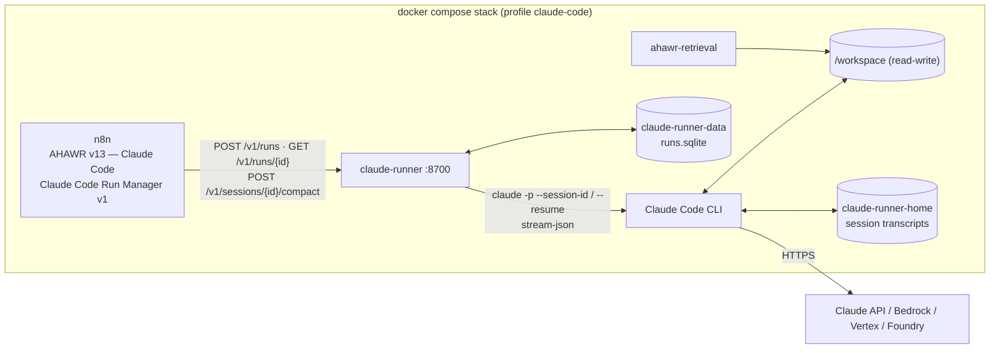

# claude-runner — AHAWR on Claude Code

**English** | [Русский](#русский)

`claude-runner` lets AHAWR use **Claude Code instead of Hermes** as the execution engine for the Architect, Worker and Reviewer. Claude Code has no HTTP run API of its own. It is a CLI (and the Agent SDK wraps the same CLI). This service runs it headless (`claude -p --output-format stream-json`) behind the **same `/v1/runs` contract the Hermes gateway exposes**. As a result, the AHAWR orchestration (polling, retries, run/session persistence in Data Tables, recovery) keeps working unchanged.



## Can n8n drive Claude Code the way it drives Hermes?

Yes, with one difference: Hermes is a server, and Claude Code is a process. The options checked were:

| Option | Verdict |
|---|---|
| Claude Code CLI headless (`claude -p`, `--output-format stream-json`, `--session-id`, `--resume`, `--permission-mode`, `--allowedTools`/`--disallowedTools`) | **Used.** Gives a session id, the final result, cost/usage, typed errors and resumable sessions. `/compact` also works non-interactively. |
| Claude Agent SDK (Python/TypeScript) | The same CLI as a library. It adds nothing needed here, so the runner calls the CLI directly. |
| n8n *Execute Command* running `claude -p` inside the n8n container | Blocks an n8n execution for the whole run, and it loses the run/poll/resume model. It would also give the agent n8n's container and credentials. |
| n8n community nodes (`n8n-nodes-claudecode` and others) | Third-party, the same blocking model, and they do not fit the existing Run Manager contract. |
| Claude Code routines `/fire` API, cloud sessions | Run in Anthropic's cloud against a GitHub repository, not against the local workspace, and there is no result/poll API for AHAWR. |
| Managed Agents (Claude API) | Hosted agent loop in a cloud sandbox. It does not see the local workspace and is a different product surface. |

## API (Hermes-compatible)

| Endpoint | Behaviour |
|---|---|
| `POST /v1/runs` `{input, model, provider, session_id?, working_directory?, role?}` | Starts a Claude Code turn asynchronously → `{run_id, session_id, status: "queued"\|"running"}`. With a `session_id` the saved session is resumed. If that session already has a run in flight, the same run is returned (`attached: true`), so there are never two concurrent turns in one session. |
| `GET /v1/runs/{run_id}` | `{status: queued\|running\|completed\|failed\|cancelled, output, error: {code, message}, http_code, session_id, cost_usd, num_turns, context_tokens, permission_denials}` |
| `POST /v1/runs/{run_id}/cancel` | Interrupts the turn (SIGINT). The session stays resumable. |
| `POST /v1/sessions/{session_id}/compact` `{mode?: auto\|always\|off}` | Runs Claude Code's `/compact` on the saved session when its context exceeds `CLAUDE_RUNNER_COMPACT_MIN_TOKENS` → `completed` / `skipped` (with `reason`) / `failed`. This replaces the Hermes TUI WebSocket compression. |
| `GET /v1/sessions/{session_id}`, `GET /health` | Session binding and context size; CLI version, auth mode, run counts. |

**Sessions.** The `session_id` AHAWR stores is the Claude Code session UUID. An id Claude Code does not know (for example one left over from Hermes in the Data Table) is bound to a fresh Claude Code session. The caller keeps its id and gets `session_created: true`. Transcripts live in the `claude-runner-home` volume, so sessions survive restarts and rebuilds.

**Failures map onto the Run Manager's rules:**

| Failure | Mapping | Run Manager result |
|---|---|---|
| Rate or usage limits | `rate_limit`, `http_code: 429` | Retried with the configured delays |
| API overload | `overloaded`, `http_code: 529` | Retried |
| Upstream 5xx | `server_error`, with the upstream status | Retried |
| Run timeout | `timeout`, `http_code: 408` | Retried |
| Unknown model, `max_turns`, `max_budget`, CLI errors | Code set, `http_code` not set | Permanent failure |
| Run interrupted by a runner restart or shutdown | `404 run_not_found` | The saved session is resumed with `resume_input` |

## Role profiles (Claude Code permissions)

| Role | Default permission mode | Denied tools |
|---|---|---|
| `worker` | `bypassPermissions` (edits, commands) | `Read(./.env)`, `Read(./.env.*)`, `Read(**/.env)`, `Read(**/.env.*)`, `Bash(git commit *)`, `Bash(git push *)` |
| `reviewer` | `dontAsk` (reads, read-only commands) | `Edit`, `Write`, `NotebookEdit`, and the `.env` reads |
| `architect` | `dontAsk` | `Edit`, `Write`, `NotebookEdit`, and the `.env` reads |

Override any of these per role with `CLAUDE_RUNNER_<ROLE>_PERMISSION_MODE`, `_ALLOWED_TOOLS`, `_DISALLOWED_TOOLS`, `_APPEND_SYSTEM_PROMPT` and `_MAX_TURNS`. Deny rules are enforced even in `bypassPermissions`: a real run confirmed that the Worker could not read `.env`. Claude Code refuses `bypassPermissions` as root, which is why the container runs as the `node` user. The Worker can still reach environment variables through Bash, so give the container only the model credential. `CLAUDE_RUNNER_*` values, including the runner's own API key, are removed from the CLI's environment.

## Setup

1. In `.env` next to `docker-compose.yml`, set `AHAWR_WORKSPACE_DIR` and **one** model credential:
   * `ANTHROPIC_API_KEY` — a Claude Console key, billed per use. This is the recommended option for unattended automation.
   * `CLAUDE_CODE_OAUTH_TOKEN` — a one-year token from `claude setup-token` for Pro/Max/Team/Enterprise plans. Personal automation only: Anthropic does not allow offering claude.ai login or subscription limits in products built for others.
   * Bedrock, Vertex or Foundry — their `CLAUDE_CODE_USE_*` variables.
2. Optionally pin the CLI version with `CLAUDE_CODE_VERSION`. Add the build tools your project needs to `CLAUDE_RUNNER_EXTRA_APT_PACKAGES`, because the Worker runs your tests inside this container.
3. Start the stack with the profile:

   ```powershell
   docker compose --profile claude-code up -d --build
   docker compose exec claude-runner curl -s http://127.0.0.1:8700/health
   ```

4. In n8n:
   * import `Claude_Code_Run_Manager_v1.json`, then `AHAWR_v13_ClaudeCode.json`;
   * create a **Bearer Auth** credential named `Claude Runner API` with the `CLAUDE_RUNNER_API_KEY` value (any value if the key is empty) and select it on the five HTTP nodes of the Run Manager;
   * check that `Architect/Worker/Reviewer Start` point to the imported Run Manager.
5. Add the `runner_url` column and the `claude-code` row from `hermes_config.csv` to the `hermes_config` Data Table. Models are Claude Code aliases (`opus`, `sonnet`, `haiku`) or full model names. Missions keep their `state_namespace`; give Claude Code runs their own namespace if the Hermes version runs the same missions.

The Hermes workflows (`AHAWR_v13.json`, `Hermes_Run_Manager_v5.json`) are untouched. Both variants can be imported side by side, since they have different workflow ids.

## Local models: LiteLLM + llama.cpp

Claude Code speaks only the Anthropic Messages API (`/v1/messages`), while llama.cpp's `llama-server` is OpenAI-compatible (`/v1/chat/completions`). The `litellm` container (profile `local-llm`, config in [`../litellm/config.yaml`](../litellm/config.yaml)) translates between them:

```
claude-runner ──Anthropic /v1/messages──▶ litellm:4000 ──OpenAI /v1/chat/completions──▶ llama-server (host :8080)
```

1. Run llama.cpp on the host with tool calling (`--jinja`) and a context window of at least 32k:
   `llama-server -m model.gguf --jinja -c 32768 --host 0.0.0.0 --port 8080`
2. In `.env`, uncomment the *Local model* block of `.env.example`:
   * `LLAMACPP_*` and `LITELLM_MASTER_KEY` for LiteLLM;
   * `ANTHROPIC_BASE_URL=http://litellm:4000` and `ANTHROPIC_AUTH_TOKEN` (the same value as the master key) for Claude Code;
   * the model and token settings listed below.
3. `docker compose --profile claude-code --profile local-llm up -d --build`
4. In the `claude-code` row of `hermes_config`, set the models to `local-coder`. Only the roles you want to run locally need it, but see *mixing* below.

What the settings do, verified with Claude Code 2.1.283 → LiteLLM 1.102.1 → an OpenAI-compatible server, including tool calls, resume and `/compact`:

| Setting | Why |
|---|---|
| `use_chat_completions_url_for_anthropic_messages: true` (LiteLLM) | LiteLLM otherwise sends `openai/*` models to the Responses API (`/v1/responses`), which llama.cpp lacks. |
| `drop_params`, `additional_drop_params: [prompt_cache_key]` (LiteLLM) | Anthropic-only fields are not forwarded to llama.cpp. |
| `"*"` model entry (LiteLLM) | Any other model name, such as a Claude alias used for a background task, also goes to the local server. |
| `ANTHROPIC_DEFAULT_{OPUS,SONNET,HAIKU}_MODEL`, `CLAUDE_CODE_SUBAGENT_MODEL` | Aliases, background tasks and subagents use the local model. |
| `CLAUDE_CODE_MAX_CONTEXT_TOKENS` = llama-server `-c` | Claude Code assumes 200k for unknown models and would compact too late. |
| `CLAUDE_CODE_MAX_OUTPUT_TOKENS=8192` | The default for unknown models is 32000. |
| `CLAUDE_CODE_DISABLE_THINKING=1`, `DISABLE_PROMPT_CACHING=1` | No `reasoning_effort` or cache fields for the local model. |
| `CLAUDE_RUNNER_TOOLS=Bash,Read,Edit,Write,Glob,Grep` | Cuts the system prompt from about 15k to about 4k tokens: the tool definitions alone are about 12k. |
| `CLAUDE_RUNNER_COMPACT_MIN_TOKENS` ≈ half the window | Session compaction before resuming. Through LiteLLM the runner estimates the context size from run totals, because per-request usage is not streamed. |

**Mixing Claude and local models.** For example, a local Worker with the Architect and Reviewer on Claude:
* add Claude entries to `litellm/config.yaml` above `"*"` (commented examples are there) and give LiteLLM `LITELLM_ANTHROPIC_API_KEY`;
* keep the `ANTHROPIC_DEFAULT_*_MODEL` values that should stay Claude.

The `CLAUDE_CODE_*` settings above apply to the whole runner container, so thinking would be off for the Claude roles as well.

**Expectations.** Anthropic does not support running Claude Code on non-Claude models. Quality depends on how reliably the model makes tool calls in long agent sessions. Test a model on a few Worker tasks before relying on it.

## Development

```bash
pip install -e ".[dev]"
ruff check src tests && ruff format --check src tests && mypy src
pytest                         # a fake CLI (tests/fake_claude.py); no network, no credentials
```

---

## Русский

`claude-runner` позволяет AHAWR использовать **Claude Code вместо Hermes** для Architect, Worker и Reviewer. Своего HTTP API для запусков у Claude Code нет. Это CLI, а Agent SDK — обёртка над тем же CLI. Сервис запускает CLI без интерактива (`claude -p --output-format stream-json`) и отдаёт **тот же контракт `/v1/runs`, что и Hermes Gateway**. Поэтому оркестрация AHAWR не меняется: опрос, ретраи, хранение run/session в Data Tables и восстановление работают как раньше.

- **Можно ли подключаться из n8n так же, как к Hermes?** Да, но через этот мост. Вызов `claude -p` из Execute Command блокирует исполнение n8n на всё время работы и отдаёт агенту контейнер n8n. Community-ноды сторонние и устроены так же. Routines и облачные сессии работают с GitHub-репозиторием в облаке, а не с локальным workspace. Managed Agents — отдельный хостинговый продукт.
- **Сессии.** `session_id` в Data Tables — это UUID сессии Claude Code, транскрипты лежат в томе `claude-runner-home`. Неизвестный id (например, оставшийся от Hermes) привязывается к новой сессии, а id вызывающей стороны сохраняется.
- **Ошибки.** Лимиты (429), перегрузка (529), 5xx и таймаут считаются transient, и Run Manager их ретраит. Неизвестная модель, `max_turns` и ошибки CLI считаются постоянными. Прогон, прерванный рестартом runner, возвращает `404 run_not_found`, и Run Manager продолжает сохранённую сессию.
- **Компакция.** Вместо WebSocket-компрессии Hermes используется `POST /v1/sessions/{id}/compact`. Он вызывает `/compact` Claude Code, только когда контекст больше `CLAUDE_RUNNER_COMPACT_MIN_TOKENS`.
- **Права по ролям.**
  - Worker: `bypassPermissions`, но без чтения `.env`, `git commit` и `git push`.
  - Reviewer и Architect: `dontAsk` без `Edit` и `Write`, то есть только чтение.
  - Всё настраивается через `CLAUDE_RUNNER_<ROLE>_*`.
  - Реальный прогон подтвердил, что deny-правила работают и в `bypassPermissions`.
  - Контейнер работает не от root: под root Claude Code отказывается включать `bypassPermissions`.
- **Доступ к модели.** В `.env` нужен один из вариантов:
  - `ANTHROPIC_API_KEY` — рекомендуется для автоматизации;
  - `CLAUDE_CODE_OAUTH_TOKEN` из `claude setup-token` — подписка Pro/Max/Team/Enterprise, только для личной автоматизации;
  - переменные Bedrock, Vertex или Foundry.
- **Запуск и настройка n8n.**
  1. Запусти стек: `docker compose --profile claude-code up -d --build`.
  2. Импортируй в n8n `Claude_Code_Run_Manager_v1.json` и `AHAWR_v13_ClaudeCode.json`.
  3. Создай credential Bearer Auth с именем `Claude Runner API`.
  4. Добавь в `hermes_config` колонку `runner_url` и строку `claude-code` из `hermes_config.csv`.
- **Локальная модель (llama.cpp).**
  - Claude Code понимает только Anthropic API, а llama.cpp — OpenAI-совместимый. Между ними ставится контейнер `litellm`: профиль `local-llm`, конфиг в `litellm/config.yaml`.
  - Запусти `llama-server` с `--jinja` и `-c 32768` или больше.
  - Раскомментируй в `.env` блок *Local model* из `.env.example`.
  - Запусти стек: `docker compose --profile claude-code --profile local-llm up -d --build`.
  - В строке `claude-code` таблицы `hermes_config` укажи модели `local-coder`.
  - `CLAUDE_RUNNER_TOOLS` сокращает системный промпт примерно с 15 тыс. до 4 тыс. токенов.
  - Официально Anthropic такую схему не поддерживает, а качество зависит от того, насколько надёжно модель вызывает инструменты.
- **Совместимость.** Воркфлоу для Hermes не изменены. Обе версии можно держать в n8n одновременно.
