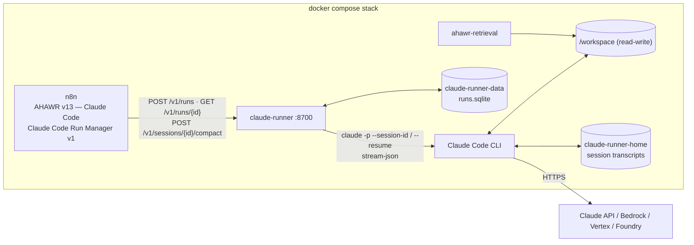

# claude-runner — AHAWR on Claude Code

**English** | [Русский](#русский)

`claude-runner` lets AHAWR use **Claude Code instead of Hermes** as the execution engine for the Architect, Worker and Reviewer. Claude Code has no HTTP run API of its own. It is a CLI (and the Agent SDK wraps the same CLI). This service runs it headless (`claude -p --output-format stream-json`) behind the **same `/v1/runs` contract the Hermes gateway exposes**. As a result, the AHAWR orchestration (polling, retries, run/session persistence in Data Tables, recovery) keeps working unchanged.



## Can n8n drive Claude Code the way it drives Hermes?

Yes, with one difference: Hermes is a server, and Claude Code is a process. The options checked were:

| Option | Verdict |
|---|---|
| Claude Code CLI headless (`claude -p`, `--output-format stream-json`, `--session-id`, `--resume`, `--permission-mode`, `--allowedTools`/`--disallowedTools`) | **Used.** Gives a session id, the final result, cost/usage, typed errors and resumable sessions. `/compact` also works non-interactively. |
| Claude Agent SDK (Python/TypeScript) | The same CLI as a library. It adds nothing needed here, so the runner calls the CLI directly. |
| n8n *Execute Command* running `claude -p` inside the n8n container | Blocks an n8n execution for the whole run, and it loses the run/poll/resume model. It would also give the agent n8n's container and credentials. |
| n8n community nodes (`n8n-nodes-claudecode` and others) | Third-party, the same blocking model, and they do not fit the existing Run Manager contract. |
| Claude Code routines `/fire` API, cloud sessions | Run in Anthropic's cloud against a GitHub repository, not against the local workspace, and there is no result/poll API for AHAWR. |
| Managed Agents (Claude API) | Hosted agent loop in a cloud sandbox. It does not see the local workspace and is a different product surface. |

### Cost shown for runs

`cost_usd` is Claude Code's own estimate (`total_cost_usd`, list prices × tokens, cache reads and
writes priced separately). Claude Code reports it for the whole session and restores it on
`--resume`, so the runner stores each run's share: the session total minus the total of the
previous finished run of the same Claude session (the cumulative value stays in `details`).
API time (`duration_api_ms`) is cumulative the same way; the run's share is `api_ms` in
`GET /v1/runs/{run_id}`, and the dashboard's summary strip shows these per-run values.
A model Claude Code does not know is priced at a fallback; the image ships
`/etc/claude-code/managed-settings.json` (`modelPricing.overrides`, USD per million tokens)
that prices the local Worker model like Claude Sonnet 5 ($2 in, $10 out, $0.20 cache read,
$2.50 cache write), the model it is usually compared with. It is an estimate for comparison,
not a bill: the local model costs nothing per token. Edit the file to change the model id
or the rates, then rebuild the image.

## API (Hermes-compatible)

| Endpoint | Behaviour |
|---|---|
| `POST /v1/runs` `{input, model, provider, session_id?, working_directory?, role?}` | Starts a Claude Code turn asynchronously → `{run_id, session_id, status: "queued"\|"running"}`. With a `session_id` the saved session is resumed. If that session already has a run in flight, the same run is returned (`attached: true`), so there are never two concurrent turns in one session. |
| `GET /v1/runs/{run_id}` | `{status: queued\|running\|completed\|failed\|cancelled, output, error: {code, message}, http_code, session_id, cost_usd, api_ms, num_turns, context_tokens, permission_denials}` |
| `POST /v1/runs/{run_id}/cancel` | Interrupts the turn (SIGINT), then stops the CLI's whole process group, so the tool processes it started stop too. The session stays resumable. |
| `POST /v1/sessions/{session_id}/compact` `{mode?: auto\|always\|off}` | Runs Claude Code's `/compact` on the saved session when its context exceeds `CLAUDE_RUNNER_COMPACT_MIN_TOKENS` → `completed` / `skipped` (with `reason`) / `failed`. The compact instructions are delivered via a PreCompact hook and appended to the **end** of the compaction request, so the request's prefix (history + system prompt) is unchanged and its prefill stays the same. This replaces the Hermes TUI WebSocket compression. |
| `GET /v1/sessions/{session_id}/digest?max_chars=12000` | What the session already did, from its runs' activity logs: the model's text, each tool call with a shortened result, compactions and results; the newest entries are kept when it is cut. The Run Manager gives it to a fresh session when the old one cannot be compacted. |
| `GET /v1/sessions/{session_id}`, `GET /health` | Session binding and context size; CLI version, auth mode, run counts. |
| `GET /v1/runs?role=&status=&session_id=&limit=`, `GET /v1/runs/{run_id}/events?after=N` | Read-only run list and each run's activity (the dashboard's data, see below). |

**Sessions.** The `session_id` AHAWR stores is the Claude Code session UUID. An id Claude Code does not know (for example one left over from Hermes in the Data Table) is bound to a fresh Claude Code session. The caller keeps its id and gets `session_created: true`. Transcripts live in the `claude-runner-home` volume, so sessions survive restarts and rebuilds.

**Failures map onto the Run Manager's rules:**

| Failure | Mapping | Run Manager result |
|---|---|---|
| Rate or usage limits | `rate_limit`, `http_code: 429` | Retried with the configured delays |
| API overload | `overloaded`, `http_code: 529` | Retried |
| Upstream 5xx | `server_error`, with the upstream status | Retried |
| Run timeout | `timeout`, `http_code: 408` | Retried |
| Unknown model, `max_turns`, `max_budget`, CLI errors | Code set, `http_code` not set | Permanent failure |
| Run interrupted by a runner restart or shutdown | `404 run_not_found` | The saved session is resumed with `resume_input` |

## Role profiles (Claude Code permissions)

| Role | Default permission mode | Denied tools |
|---|---|---|
| `worker` | `bypassPermissions` (edits, commands) | `Read` of `.env`, `.env.local`, `.env.*.local`, `.env.development`/`.dev`, `.env.production`/`.prod`, `.env.staging`, `.env.test` (in `./` and `**/`; `.env.example` stays readable), `Bash(git commit *)`, `Bash(git push *)` |
| `reviewer` | `dontAsk`; allowed Bash: `ahawr-search`, `grep`, `ls`, `wc`, `head`, `tail`, `cat`, `diff`, `bash -n`, read-only `git` (`diff`, `status`, `log`, `show`, `ls-files`, `blame`, also as `git -C <dir> …`) | `Edit`, `Write`, `NotebookEdit`, the `.env` reads, Bash redirections to a file (`> f`), `git … --output` |
| `architect` | `dontAsk` | `Edit`, `Write`, `NotebookEdit`, and the `.env` reads |

In `dontAsk` a Bash command runs only if a rule allows it. Before this list the Reviewer had no Bash at all: a real mission logged 105 denied calls (plain `grep`, `wc`, `git status`, `ahawr-search`), so it judged a Worker's report without being able to check it. The list is inspection only; building and anything that writes stay denied (a Reviewer that must run a build needs its own narrow rule, e.g. `Bash(bash /path/verify.sh)`, in `CLAUDE_RUNNER_REVIEWER_ALLOWED_TOOLS`, which replaces the default list; an empty value gives the old no-Bash Reviewer). The rules are defence in depth, not a sandbox.

Override any of these per role with `CLAUDE_RUNNER_<ROLE>_PERMISSION_MODE`, `_ALLOWED_TOOLS`, `_DISALLOWED_TOOLS`, `_APPEND_SYSTEM_PROMPT`, `_MAX_TURNS` and `_ADD_DIRS` (comma-separated folders passed as `--add-dir`: in `dontAsk` mode a role can read only its working directory and these, e.g. `CLAUDE_RUNNER_REVIEWER_ADD_DIRS=/tmp/dcfr-work` for a mission whose Worker keeps its results in `/tmp`). Deny rules are enforced even in `bypassPermissions`: a real run confirmed that the Worker could not read `.env`. Claude Code refuses `bypassPermissions` as root, which is why the container runs as the `node` user. The Worker can still reach environment variables through Bash, so give the container only the model credential. `CLAUDE_RUNNER_*` values, including the runner's own API key, are removed from the CLI's environment.

### Reviewer result access

By default the Reviewer reads only the mission's working directory. When an Architect or Worker places results the Reviewer must verify (notes, artifacts, logs) in `/tmp` or outside the mission folder, the Reviewer cannot open them and the attempt is lost to "cannot check the file".

Two ways to let the Reviewer reach those files:

* **`CLAUDE_RUNNER_REVIEWER_ADD_DIRS`** — static, requires a runner restart. Comma-separated folders passed as `--add-dir`; the Reviewer can then read them in addition to the mission working directory.
* **`CLAUDE_RUNNER_<ROLE>_APPEND_SYSTEM_PROMPT`** (default: none) — extra prompt text appended to the role's system prompt. This is how the opt-in **RESULT PLACEMENT RULE** is delivered: the Architect and Worker are told to place every file the Reviewer must verify inside the mission working directory (or a subfolder), and to cite its exact path in the report. No new permission, no directory access, no restart — the Reviewer's read surface is unchanged.

| Setting | Meaning |
|---|---|
| `CLAUDE_RUNNER_REVIEWER_ADD_DIRS` | Extra folders the Reviewer may read (default: none). Requires a runner restart. |
| `CLAUDE_RUNNER_ARCHITECT_APPEND_SYSTEM_PROMPT` | Extra prompt text for the Architect (default: none). Used to enable the RESULT PLACEMENT RULE. |
| `CLAUDE_RUNNER_WORKER_APPEND_SYSTEM_PROMPT` | Extra prompt text for the Worker (default: none). Used to enable the RESULT PLACEMENT RULE. |

The rule is **off by default**: the shipped `agent_prompts.example.csv` rows do not carry it, so the Reviewer still reads only the mission working directory. To enable it, an operator appends the exact paragraph to the `system_prompt` column of the `architect` and `worker` rows in the mission's `agent_prompts` data table, or sets the corresponding `CLAUDE_RUNNER_<ROLE>_APPEND_SYSTEM_PROMPT` env var. No workflow node, per-run flag, or runner restart is needed — the rule lives entirely in the prompt text. See `docs/ahawr-cheaper-retries.md` §5.3 for the exact opt-in paragraphs and the enable step.

### Compaction

Every compaction (auto, manual `/compact`, or the runner's `/compact` before continuing a session) is given custom compact instructions. They are delivered two ways that Claude Code accepts as *custom compact instructions*:

1. **PreCompact hook** — a settings file (`--settings <path>`) that carries a `PreCompact` hook printing the instruction text to stdout. Claude Code appends the hook's stdout to the compaction request.
2. **`/compact <instructions>`** — the runner puts the instruction text on the `/compact` command itself.

Both texts are appended to the **end** of the compaction request, so the request's prefix (history + system prompt) is untouched and the prefill is unchanged. The default instruction text fixes the five required headings in order — `## Task and acceptance criteria`, `## Findings (file:line)`, `## Changed files`, `## Checks done / not done`, `## Next step` — targets 1500–2000 tokens (hard cap 2000), and forbids verbatim copying of tool outputs, logs, diffs and code (use `file:line` references instead).

The runner also decides *when* to compact a session before resuming it:

| Setting | Meaning |
|---|---|
| `CLAUDE_RUNNER_COMPACT_MODE` | `auto` (default) compacts only above the threshold, `always` compacts whenever a session is continued, `off` never compacts. |
| `CLAUDE_RUNNER_COMPACT_MIN_TOKENS` | Context size (in tokens) above which `auto` compacts. Default 120000. A provider block can override it with `…__COMPACT_MIN_TOKENS`. |
| `CLAUDE_RUNNER_COMPACT_TIMEOUT_SECONDS` | Wall-clock budget for the compaction run itself. Default 600. |
| `CLAUDE_RUNNER_COMPACT_INSTRUCTIONS` | The instruction text. Empty = Claude Code's built-in summarizer (no custom instructions). Unset = the built-in default shown above. |
| `CLAUDE_RUNNER_LOCAL_COMPACT_INSTRUCTIONS` | Delivers the instructions to the local (credential-isolating) provider only. Off (`0`) keeps every provider on the stock summarizer (default: on). |

### Fresh-session retry

Instead of compacting the old session and resuming it, a retry can start a **fresh** session. This is useful when the old context is too large to compact economically (e.g. a small local model that compacts slowly), or when a clean slate is preferred.

| Setting | Meaning |
|---|---|
| `CLAUDE_RUNNER_RETRY_FRESH_SESSION` | `1` = a retry with a previous session starts a new session; `0` (default) = the existing compact-and-resume path is used. |
| `CLAUDE_RUNNER_RETRY_INPUT_CHARS` | Character budget for the fresh-session retry input (default 32000). The four-part input — task, review findings, previous report, previous session digest — is cut to fit this budget, with only the digest trimmed. A marker notes the cut. |

The fresh-session retry input is assembled in the same order the Run Manager already builds resume inputs: task, findings, previous report, and the previous session's digest (newest last). When the digest alone would break the budget, it is cut and a one-line marker (`[previous session's digest trimmed to the retry budget]`) is appended so the model knows it is incomplete. The three fixed parts are kept whole as long as they fit.

Only `CLAUDE_RUNNER_RETRY_FRESH_SESSION` can be overridden per provider with `CLAUDE_RUNNER_PROVIDER_<NAME>__RETRY_FRESH_SESSION` in a provider block (config.py `PROVIDER_RUNNER_KEYS`); `CLAUDE_RUNNER_RETRY_INPUT_CHARS` is global only.

**How the runner decides.** In `start()` (`runs.py`), when the request carries a `session_id`, the runner looks up the provider's `retry_fresh_session_for` value. If it is true, `_bind` is called with `fresh=True`: a new Claude Code session is created, `session_created` is `true`, and `cut_retry_input` trims the prompt to the budget. If it is false (the default), the existing path is used: the old session is resumed after compaction if needed, and `session_created` is `false`.

**Effect on compaction.** When fresh-session retry is on, `RunManager.compact()` returns `skipped("fresh_session_retry")` before any `/compact` run: compacting the old session would be wasted work because the retry will start a new session anyway. When the switch is off, compact runs as usual.

**How the runner decides to compact before resuming.** The runner reads the session's current context size (from the last request's usage, or the run totals for a gateway that streams no per-request usage) and compares it with the threshold. The threshold is `CLAUDE_RUNNER_COMPACT_MIN_TOKENS` (default 120000), or — for a provider block — the provider's own `…__COMPACT_MIN_TOKENS` when set (`runs.py`: the provider value is used when the request does not pass `min_tokens`). With `auto`, the runner skips compaction while the context is below this threshold.

**Claude Code's own autocompact trigger.** Separately, Claude Code compacts on its own as the context grows, and a provider block can configure that trigger with either:

* `…__CLAUDE_AUTOCOMPACT_PCT_OVERRIDE` — a percentage of the 65536-token window (e.g. `56.98` → 37342). Overrides the window path when set.
* `…__CLAUDE_CODE_AUTO_COMPACT_WINDOW` — the resolved window; the actual trigger is `window − min(max_output, 20000) − 13000`, where `max_output` is `…__CLAUDE_CODE_MAX_OUTPUT_TOKENS` (default 8192) and 13000 is Claude Code's hardcoded precompute buffer.

The runner does not use this trigger to decide when to compact; it only validates it at startup (`config.py`): the trigger must stay inside the 65536-token window and leave headroom of at least 20000 tokens (one large tool output, which Claude Code saves to a file via `BASH_MAX_OUTPUT_LENGTH` and similar limits). A value that violates either constraint makes the runner refuse to start.

**Output cap for a compaction request.** The LiteLLM pre-call hook (`ahawr_hooks.py`) recognises a compaction request by the fixed marker `CRITICAL: Respond with TEXT ONLY` at the start of the last user message and caps its `max_tokens` at 3000 (`COMPACTION_MAX_TOKENS`), so the summary is generated within a known limit and is not cut off mid-way. `max_tokens` is a request parameter, not part of the prompt prefix, so capping it does not break the llama.cpp prefix cache.

## Setup

1. In `.env` next to `docker-compose.yml`, set `AHAWR_WORKSPACE_DIR` and **one** model credential:
   * `ANTHROPIC_API_KEY` — a Claude Console key, billed per use. This is the recommended option for unattended automation.
   * `CLAUDE_CODE_OAUTH_TOKEN` — a one-year token from `claude setup-token` for Pro/Max/Team/Enterprise plans. Personal automation only: Anthropic does not allow offering claude.ai login or subscription limits in products built for others.
   * Bedrock, Vertex or Foundry — their `CLAUDE_CODE_USE_*` variables.
2. Optionally pin the CLI version with `CLAUDE_CODE_VERSION`. Add the build tools your project needs to `CLAUDE_RUNNER_EXTRA_APT_PACKAGES`, because the Worker runs your tests inside this container.
3. Build and start the whole stack (n8n, ahawr-retrieval, claude-runner, litellm):

   ```powershell
   docker compose up -d --build     # builds and starts every container of the stack
   docker compose exec claude-runner curl -s http://127.0.0.1:8700/health
   ```

4. In n8n:
   * import `Claude_Code_Run_Manager_v1.json`, then `AHAWR_v13_ClaudeCode.json`;
   * no n8n credential is needed: the Run Manager's HTTP nodes send `Authorization: Bearer <hermes_config.runner_api_key>` only when that column is set. Leave both `CLAUDE_RUNNER_API_KEY` and `runner_api_key` empty (the run API has no host port), or set both to the same value;
   * copy the Run Manager's workflow id from its URL (`/workflow/<id>`) into `hermes_config.run_manager_workflow_id` of the `claude-code` row. When the column is empty, `nhjwX1G7FiVTO2Ah` is used. The Start nodes need no editing: their inputs come from the `Build … Run Input` Code nodes, and the Run Manager accepts them as they are.
5. Add the `runner_url` column and a `claude-code` row from `hermes_config.example.csv` to the `hermes_config` Data Table. Models are Claude Code aliases (`opus`, `sonnet`, `haiku`) or full model names. Missions keep their `state_namespace`; give Claude Code runs their own namespace if the Hermes version runs the same missions.

The Hermes workflows (`AHAWR_v13.json`, `Hermes_Run_Manager_v5.json`) are untouched. Both variants can be imported side by side, since they have different workflow ids.

## Mission working directories

The `working_directory` column of the `missions` Data Table (e.g. `D:\OpenAIProjects\job-searching-assistant`, `D:\ClaudeProjects\...`) chooses the project:

* The drive (`AHAWR_HOST_DRIVE`, default `D:\`) is mounted at `/d`: read-write for claude-runner, read-only for ahawr-retrieval. `CLAUDE_RUNNER_PATH_MAP` and `RETRIEVAL_PATH_MAP` map a mission's Windows path onto that mount.
* Architect, Worker and Reviewer run in that folder.
* The folder is also written into the prompts as `WORKING DIRECTORY: D:\… (shell: /d/…)`: into the mission text for the Architect and Reviewer, and at the top of each Worker task. Plans and reviews therefore use the real paths. The shell form equals the path inside the container, because drive D: is mounted at `/d`, and it also matches Git Bash/MSYS on Windows.
* Retrieval uses a corpus named after the path (`d-openaiprojects-job-searching-assistant`). It is indexed from that folder on first use and synced on every later request. `missions.retrieval_corpora_json` still overrides the corpus list.
* Missions without `working_directory` (`Null`) run in `/workspace` with the `hermes_config` corpora, as before.
* A folder that does not exist fails the run visibly (`invalid_working_directory`).

Give missions of different projects different `state_namespace` values. The Worker can reach the whole mounted drive. To narrow that, replace the drive mount in `docker-compose.yml` by bind mounts of the project folders at the matching `/d/...` paths.

## On-demand retrieval: `ahawr-search`

The Worker (or a human) can query the mission's corpus directly, outside the run's own context assembly:

```bash
ahawr-search "where is the retry delay applied?"
ahawr-search "query" --k 3 --budget 2000 --root . --url http://ahawr-retrieval:8500
```

* `--k N` (default 5; also `-n`, `--max`, `--limit`, `--top`, `--count`) — how many fragments to print. Option abbreviations are off, so `--max` is never read as `--max-tokens`.
* `--budget T` (default 1500, allowed 100–100000, clamped with a note on stderr) — the token budget sent to the service.
* To search another folder, for example a scratch checkout of upstream code, pass it as `--root /d/…/src` or as an extra path argument (`ahawr-search "state_write f_l" /d/rag-tmp/tree/src`). A folder searched for the first time is indexed by that call (about 8-9 s for 30 small files, measured; later calls take 0.2-0.5 s), which is why the default timeout is 30 s. On a large tree the first answer can still time out; the service keeps indexing, so repeat the command or add `--timeout 120`. Search a subfolder, not the whole checkout.
* When the call fails, the printed line says why (`retrieval unavailable: the service rejected the request (HTTP 422): …`, `the service failed`, `cannot be reached`, `no answer within 30 s…`) and the exit code is still 0.
* `--root PATH` (default the current directory) — the working directory; it is resolved with `realpath` and must fall under `/d/` or `/workspace` (a `/tmp/X` symlink that resolves to `/d/rag-tmp/X` is used). If the resolved path is outside the allowed roots, the command prints that the folder is unavailable to the service and exits 0.
* `--url` — the retrieval service URL; defaults to `http://ahawr-retrieval:8500`, overridable with `AHAWR_RETRIEVAL_URL`.

Each fragment is printed as `path:start-end` followed by its text, in the service's ranking order. The request is a `POST /retrieve` with `profile: worker`, `budget: {max_tokens: T}`, a corpus named after the resolved root (e.g. `/d/OpenAIProjects/job-searching-assistant` → `d-openaiprojects-job-searching-assistant`) and `corpus_roots: {slug: resolved_root}`.

The query may be several words without quotes or `--query`/`-q`; `--limit`/`--top`/`-k` mean `--k` and `--max-tokens` means `--budget`. An unknown option is reported on stderr and ignored, so a model that guesses the interface still gets its answer.

**Fail-open.** On any connection error, timeout (default 10 s) or 5xx response the command prints one short line (`retrieval unavailable`) and exits 0 — a retrieval outage never blocks the Worker or the run.

### Making agents use it: the search-first hook

A rule in the prompt ("search with `ahawr-search` first") is followed once at best by a small local model, which then falls back to `grep`. With `SEARCH_FIRST` the runner adds a Claude Code **PreToolUse hook** (`search_hook.py`, a settings file passed with `--settings`) for the Bash, Grep and Glob tools:

* until the session has called `ahawr-search`, an **exploratory** search is refused (exit code 2, the message goes back to the model and shows the syntax): `rg`, `find`, `git grep`, a recursive `grep` or one whose paths include a directory or a glob, the `Grep` and `Glob` tools. At most two refusals; a model that insists is let through;
* after that the hook reminds once every `CLAUDE_RUNNER_SEARCH_FIRST_EVERY` (default 6) exploratory searches without a new `ahawr-search`; `0` turns the reminders off;
* checking a known file (`grep -n text path/to/file.py`) or filtering a pipe is never touched;
* any error inside the hook means "allow": it can not break a run. Decisions are appended to `<CLAUDE_CONFIG_DIR>/search-first/decisions.jsonl` (`search`, `deny-first`, `deny-again`).

Enable it with `CLAUDE_RUNNER_SEARCH_FIRST=1` for all providers, or per provider with `CLAUDE_RUNNER_PROVIDER_<NAME>__SEARCH_FIRST=1` (`docker-compose.yml` turns it on for `LOCAL`; `AHAWR_SEARCH_FIRST=0` in `.env` turns that off). It applies to the roles in `CLAUDE_RUNNER_SEARCH_FIRST_ROLES` (default `worker`) and only when `ahawr-search` is installed. In the first check on the local Qwen model a Worker told to `grep -rn` was refused once, called `ahawr-search`, and answered correctly.

## Dashboard: watch the agents work

Open **http://localhost:8701** (host port `AHAWR_DASHBOARD_PORT`). The `ahawr-dashboard` container shows every Architect, Worker and Reviewer run of both AHAWR variants, most recent activity first:

* **Claude Code runs**, read from claude-runner.
* **Hermes sessions**, read from the Hermes API server (`HERMES_API_URL`, `HERMES_API_KEY`: the `API_SERVER_KEY` that the n8n "Bearer Auth account" credential holds). By default it shows only the sessions AHAWR starts through the API (`HERMES_SESSION_SOURCE=api_server`). This needs a Hermes version with `GET /api/sessions`; the source line in the sidebar says when it is missing, unreachable or the key is wrong.

* **Theme:** the "Theme" button in the sidebar cycles Auto → Light → Dark. Auto follows the OS
  `prefers-color-scheme`; Light and Dark are fixed palettes. The choice is persisted via
  localStorage (`ahawr-dashboard-theme`), with Auto removing the key. A small inline script in
  `<head>` — before any stylesheet — reads the key and applies `data-theme` to `<html>` before
  first paint, so the theme is applied before the page paints and persists across reloads without
  a flash of the wrong theme; it is wrapped in try/catch and falls back to Auto on error.
  `color-scheme` is declared as `light dark` on `:root`, `light` for `[data-theme="light"]` and
  `dark` for `[data-theme="dark"]`; each palette defines the full set of CSS variables (the
  monospace stack `--mono` is theme-invariant).

The layout follows DeepSeek Harness' *Trajectory* view:

* **Summary strip:** turns, steps (model requests), wall and API time, input/output tokens, cache hit rate, throughput (tok/s), cost, context size, tool count.
* **Timeline** with three lanes: prompts (Input); model requests (Model), split into waiting for the first token and generating; tool executions (Tools). A still-running tool is hatched. Hover a span for its numbers; click it to jump to the row.
* **Ledger:**
  * each record has a colored badge: USER, SYSTEM, THINK, ASSISTANT, TOOL, RETRY, COMPACT, RESULT, END;
  * each row shows its offset from the start and its duration;
  * turn marks and step headers: model, TTFT, generation time, input tokens with cache reads, output tokens, tok/s;
  * a tool call and its result share one row (`name args → result`);
  * slow tools are highlighted;
  * you can search and hide thinking or system rows;
  * while a model is generating, a dashed row streams its tokens.
* **Inspector** (click a row):
  * **Steps:** token breakdown (uncached, cache read, cache write, output), start, total duration, TTFT, generation, throughput, and the step's thinking, answer and tool calls.
  * **Tools:** payload (a diff for edits, the command for shell calls), result, duration.
  * **Any record:** raw JSON.
* **Session:** clicking the session id lists all runs of that session, for example the Architect's across a mission.
* **RAG:** when a prompt carries ahawr-retrieval context (`=== RETRIEVED CONTEXT … ===`), a RAG row follows it in the ledger. It lists the chunks with their source, file, lines, symbol and score, and the inspector shows the full context. The summary strip shows `RAG N chunks`. A Worker or Reviewer run without context shows `RAG none`: retrieval is off in `hermes_config`, there is no corpus, or the request failed (see the main README).
* **Export:** the header links download the run, or the whole session with all its runs oldest first, as Markdown or JSON (`GET /api/runs/{id}/export?format=md|json`, `GET /api/sessions/{id}/export?format=md|json`). The Markdown mirrors the ledger: turns, steps with timings and tokens, thinking, answers, tool calls with results, the RAG chunk list, retries and the outcome. The JSON keeps every entry.

What each source can show:

* **Claude Code:** timings are exact. They are measured from the token stream (`--include-partial-messages`), and tokens come from each request's usage.
* **Hermes:** Hermes stores when each message was written. A step is therefore timed from the previous message to the answer (marked `≈`), a tool from its call to its result, and tokens are the session totals. Tool results are shown by their `output`/`content`, and a non-zero `exit_code` or an `error` marks the call as failed.

For Claude Code runs, the thinking shown does not depend on the provider, because the dashboard reads Claude Code's own event stream (`stream-json`), not a provider API:

* **Anthropic:** thinking arrives as Claude's thinking blocks.
* **Local llama.cpp or a third-party model behind LiteLLM** (OpenRouter and others): the model's `reasoning_content` reaches Claude Code as thinking blocks. `CLAUDE_CODE_DISABLE_THINKING=1` does not hide it; it only stops Claude Code from requesting extended thinking.

A model that returns no reasoning shows only answers and tool calls.

* **Separate container, read-only except Stop.**
  * The dashboard cannot start or compact runs; its Stop button cancels a queued or running Claude Code run (the request needs the `X-AHAWR-Dashboard` header, so another site cannot send it). The run API (8700) stays unpublished.
  * The Hermes key lives only in `ahawr-dashboard`. The claude-runner Worker runs arbitrary commands, and with that key it could drive Hermes on the host.
  * The dashboard is published on `127.0.0.1` only and answers only to the host names in `DASHBOARD_HOSTS` (default `localhost,127.0.0.1`), which guards against DNS rebinding.
  * It shows prompts, code and command output, so do not publish it more widely.
* **Storage.** Claude Code activity is kept in `/data/events/<run_id>.jsonl` in the `claude-runner-data` volume for `CLAUDE_RUNNER_EVENT_RETENTION_DAYS` days (default 14). Tool results are clipped to 20k characters per entry. Hermes data is read live from Hermes and not copied.
* **Live tokens.** `CLAUDE_RUNNER_LIVE_TOKENS=false` turns off the token stream (`--include-partial-messages`). Finished blocks and token counts still appear, but step timings do not.
* **Data API.** claude-runner serves the same data at `GET /v1/runs` and `GET /v1/runs/{id}/events`, with bearer auth when `CLAUDE_RUNNER_API_KEY` is set.

## Providers per role (like Hermes): Claude and a local llama.cpp model

Every run carries the role's `provider` from `hermes_config` (`architect_provider`, `worker_provider`, `reviewer_provider`), exactly as with Hermes. claude-runner looks up a provider block `CLAUDE_RUNNER_PROVIDER_<NAME>__<VARIABLE>` (note the double `_`):

* **No block for the provider** (e.g. `anthropic`): the run uses the container credential (`ANTHROPIC_API_KEY` or `CLAUDE_CODE_OAUTH_TOKEN`) and goes to Anthropic directly.
* **A block exists** (e.g. `local`): its variables are set for that run only. If the block sets an endpoint or credential (`ANTHROPIC_BASE_URL`, `ANTHROPIC_AUTH_TOKEN`, ...), the container's Anthropic credentials are removed from that run, so a local Worker never sees your subscription token. `TOOLS` and `COMPACT_MIN_TOKENS` in a block configure the runner for that provider.
* **`CONTEXT_PROBE_URL` / `CONTEXT_PROBE_KEY`** in a block: before each run the runner asks that llama-server for the model's `--ctx-size` (`GET /v1/models`, router mode lists every model's start arguments, loaded or not) and sets `CLAUDE_CODE_MAX_CONTEXT_TOKENS` and `CLAUDE_CODE_AUTO_COMPACT_WINDOW` to it, so a server restarted with another context size needs no runner change. **`COMPACT_PCT`** sets the autocompact trigger as a percentage of that window (default: `CLAUDE_AUTOCOMPACT_PCT_OVERRIDE`, else the static trigger's share of 65536, 67.66%), capped at the window minus `min(max_output, 20000) + 13000`. The pre-resume `/compact` threshold follows the same window: **`COMPACT_MIN_PCT`** of it, else `COMPACT_MIN_TOKENS` scaled from 65536 (40000 → 60000 at 96K), never above the autocompact trigger; a skipped compaction reports `min_tokens` and `window`. The key stays in the runner. The run's event log gets a `context_window` record (`source: probe` or `static`); if the server does not answer, or the window would leave less than 8000 tokens before compaction, the block's static values apply.

```
Architect  provider=anthropic ─┐
Reviewer   provider=anthropic ─┼─ claude-runner ──CLAUDE_CODE_OAUTH_TOKEN──▶ Anthropic
Worker     provider=local ─────┘        └──ANTHROPIC_BASE_URL=http://litellm:4000──▶ litellm ──OpenAI API──▶ llama-server (host :8080)
```

Claude Code speaks only the Anthropic Messages API, while llama.cpp's `llama-server` is OpenAI-compatible. The `litellm` container (config in [`../litellm/config.yaml`](../litellm/config.yaml)) translates between them.

**Setup for "Architect/Reviewer on Claude, Worker local":**

1. Run llama.cpp on the host with tool calling and a 64k context (the `.env.example` compaction settings assume 65536; 32k is the bare minimum):
   `llama-server -m model.gguf --jinja -c 65536 --host 0.0.0.0 --port 8080`
2. In `.env`:
   * `CLAUDE_CODE_OAUTH_TOKEN` (or `ANTHROPIC_API_KEY`) for the Claude roles;
   * `LITELLM_MASTER_KEY` and the `LLAMACPP_*` values;
   * the `CLAUDE_RUNNER_PROVIDER_LOCAL__*` block from `.env.example`, with `ANTHROPIC_AUTH_TOKEN` equal to `LITELLM_MASTER_KEY`.

   Do **not** set `ANTHROPIC_BASE_URL` or `ANTHROPIC_AUTH_TOKEN` globally: that would send every role to LiteLLM.
3. `hermes_config`, row `claude-code`:
   * `architect_model=opus`, `architect_provider=anthropic`;
   * `reviewer_model=opus`, `reviewer_provider=anthropic`;
   * `worker_model=<model name as llama-server knows it>` (see `GET /v1/models`, e.g. `qwen3.8-27b-gsq-rco-iq2-s-mtp`), `worker_provider=local`.

   The model is chosen only here. LiteLLM passes the name to llama-server unchanged: a router-mode server loads that model, and a single-model server answers with its loaded model. claude-runner also uses the name for Claude Code's background tasks and subagents of that run.
4. `docker compose up -d --build`. `GET /health` lists the configured providers without secrets.

Verified with Claude Code 2.1.283 in one runner. A Worker with `provider=local` went through LiteLLM 1.102.1 to an OpenAI-compatible server, with tool calls, resume and `/compact`. A Reviewer with `provider=anthropic` went to Anthropic with the OAuth token, and none of its traffic reached the local server.

What the local-provider settings do:

| Setting | Why |
|---|---|
| `use_chat_completions_url_for_anthropic_messages: true` (LiteLLM) | LiteLLM otherwise sends `openai/*` models to the Responses API (`/v1/responses`), which llama.cpp lacks. |
| `ahawr_hooks.py` pre-call hook (LiteLLM) | Claude Code sends context such as the `# Environment` block as `system` messages in the middle of the conversation. Local chat templates (Qwen, Llama, Gemma) reject them ("System message must be at the beginning"), so the hook moves them into the user turn as `<system-reminder>` blocks. |
| `drop_params`, `additional_drop_params: [prompt_cache_key]` (LiteLLM) | Anthropic-only fields are not forwarded to llama.cpp. |
| `"*"` → `openai/*` (LiteLLM) | Every model name goes to llama-server unchanged. |
| Run model → `ANTHROPIC_DEFAULT_{OPUS,SONNET,HAIKU}_MODEL`, `CLAUDE_CODE_SUBAGENT_MODEL` (set by the runner) | Background tasks and subagents of a local run use the same model as the run, so no model name is configured outside `hermes_config`. |
| `…__CLAUDE_CODE_MAX_CONTEXT_TOKENS` = llama-server `-c` | Claude Code assumes 200k for unknown models and would compact too late. |
| `…__CLAUDE_CODE_MAX_OUTPUT_TOKENS=8192` | The default for unknown models is 32000. |
| `…__CLAUDE_CODE_AUTO_COMPACT_WINDOW=65536` | The full 65536-token window; the runner computes the autocompact trigger as `window − min(max_output, 20000) − 13000`. Must leave ≥ 20000 tokens of headroom (one large tool output). |
| `…__CLAUDE_AUTOCOMPACT_PCT_OVERRIDE` | A percentage of the 65536-token window (e.g. `56.98` → 37342). Overrides the window path when set. |
| `…__CLAUDE_CODE_DISABLE_THINKING=1`, `…__DISABLE_PROMPT_CACHING=1` | No `reasoning_effort` or cache fields for the local model; the Claude roles keep thinking. |
| `…__TOOLS=Bash,Read,Edit,Write,Glob,Grep` | Cuts the system prompt from about 15k to about 4k tokens. |
| `…__COMPACT_MIN_TOKENS` ≈ half the window | Session compaction before resuming. Through LiteLLM the runner estimates the context size from run totals, because per-request usage is not streamed. |

**Expectations.** Anthropic does not support running Claude Code on non-Claude models. Quality depends on how reliably the model makes tool calls in long agent sessions. Test a model on a few Worker tasks before relying on it.

## Development

```bash
pip install -e ".[dev]"
ruff check src tests && ruff format --check src tests && mypy src
pytest                         # a fake CLI (tests/fake_claude.py); no network, no credentials
```

---

## Русский

`claude-runner` позволяет AHAWR использовать **Claude Code вместо Hermes** для Architect, Worker и Reviewer. Своего HTTP API для запусков у Claude Code нет. Это CLI, а Agent SDK — обёртка над тем же CLI. Сервис запускает CLI без интерактива (`claude -p --output-format stream-json`) и отдаёт **тот же контракт `/v1/runs`, что и Hermes Gateway**. Поэтому оркестрация AHAWR не меняется: опрос, ретраи, хранение run/session в Data Tables и восстановление работают как раньше.

- **Можно ли подключаться из n8n так же, как к Hermes?** Да, но через этот мост. Вызов `claude -p` из Execute Command блокирует исполнение n8n на всё время работы и отдаёт агенту контейнер n8n. Community-ноды сторонние и устроены так же. Routines и облачные сессии работают с GitHub-репозиторием в облаке, а не с локальным workspace. Managed Agents — отдельный хостинговый продукт.
- **Сессии.** `session_id` в Data Tables — это UUID сессии Claude Code, транскрипты лежат в томе `claude-runner-home`. Неизвестный id (например, оставшийся от Hermes) привязывается к новой сессии, а id вызывающей стороны сохраняется.
- **Ошибки.** Лимиты (429), перегрузка (529), 5xx и таймаут считаются transient, и Run Manager их ретраит. Неизвестная модель, `max_turns` и ошибки CLI считаются постоянными. Прогон, прерванный рестартом runner, возвращает `404 run_not_found`, и Run Manager продолжает сохранённую сессию.
- **Дашборд: http://localhost:8701** (контейнер `ahawr-dashboard`). Показывает прогоны Architect, Worker и Reviewer обоих вариантов:
  - прогоны Claude Code из claude-runner;
  - сессии Hermes из его API: нужны `HERMES_API_URL` и `HERMES_API_KEY` (тот же `API_SERVER_KEY`, что в n8n-кредешле «Bearer Auth account»).

  Устроен как вкладка Trajectory в DeepSeek Harness:
  - сводка: ходы, шаги, время, токены, доля кэша, ток/с, стоимость;
  - таймлайн: промпты, запросы к модели (ожидание первого токена и генерация), выполнение тулов;
  - журнал: цветные метки, смещение и длительность каждой записи, заголовки шагов с TTFT и токенами, вызов тула и его результат в одной строке, поиск;
  - инспектор записи: токены, тайминги, аргументы, результат, raw JSON;
  - RAG: если в промпте есть контекст ahawr-retrieval, под промптом идёт строка RAG со списком фрагментов (файл, строки, оценка). В сводке видно «RAG N chunks» или «RAG none»;
  - экспорт прогона или всей сессии в Markdown и JSON (ссылки в шапке).

  Для Claude Code тайминги точные, по потоку токенов. Для Hermes они приблизительные (`≈`): считаются по времени записи сообщений, а токены берутся как итог по сессии. Размышления видны для любого провайдера: Anthropic, локальный llama.cpp, сторонняя модель через LiteLLM. Дашборд только для чтения, опубликован только на `127.0.0.1`. Ключ Hermes есть только в `ahawr-dashboard`, в claude-runner с Worker'ом его нет.
- **Компакция.** Вместо WebSocket-компрессии Hermes используется `POST /v1/sessions/{id}/compact`. Он вызывает `/compact` Claude Code, только когда контекст больше `CLAUDE_RUNNER_COMPACT_MIN_TOKENS` (для провайдера — `…__COMPACT_MIN_TOKENS`). Размер контекста берётся из последнего запроса к модели, в том числе у run'а, оборванного таймаутом. Инструкции сжатия доставляются как PreCompact-hook (stdout добавляется в конец запроса на сжатие) и как текст после `/compact`; обе вставки — в конце, поэтому префикс запроса (история + системный промпт) не меняется и префилл не растёт. Текст задаётся в `CLAUDE_RUNNER_COMPACT_INSTRUCTIONS` (пусто = встроенный суммаризатор Claude Code); доставляется только локальному провайдеру, управляется `CLAUDE_RUNNER_LOCAL_COMPACT_INSTRUCTIONS` (выкл. = `0`).
- **Продолжение после сбоя.** Упавшая задача продолжается с места остановки, а не начинается заново:
  - таймаут, 5xx или переполнение контекста: Run Manager сжимает сессию (после переполнения — принудительно) и продолжает её коротким сообщением о том, почему прервалась прошлая попытка, а не повторной отправкой всей задачи;
  - если сжать не удалось, новая сессия получает исходную задачу и дайджест прошлой (`GET /v1/sessions/{id}/digest`): что уже прочитано, запущено и найдено;
  - если workflow остановился на ошибке, сессия Worker'а текущей задачи сохраняется в Task State, и перезапуск продолжает её с `RESUME TASK …`.
- **Права по ролям.**
  - Worker: `bypassPermissions`, но без чтения `.env`, `git commit` и `git push`.
  - Reviewer и Architect: `dontAsk` без `Edit` и `Write`, то есть только чтение.
  - Всё настраивается через `CLAUDE_RUNNER_<ROLE>_*`.
  - Реальный прогон подтвердил, что deny-правила работают и в `bypassPermissions`.
  - Контейнер работает не от root: под root Claude Code отказывается включать `bypassPermissions`.
- **Доступ к модели.** В `.env` нужен один из вариантов:
  - `ANTHROPIC_API_KEY` — рекомендуется для автоматизации;
  - `CLAUDE_CODE_OAUTH_TOKEN` из `claude setup-token` — подписка Pro/Max/Team/Enterprise, только для личной автоматизации;
  - переменные Bedrock, Vertex или Foundry.
- **Запуск и настройка n8n.**
  1. Запусти стек: `docker compose up -d --build`. Эта команда собирает и запускает все контейнеры.
  2. Импортируй в n8n `Claude_Code_Run_Manager_v1.json` и `AHAWR_v13_ClaudeCode.json`.
  3. Credential в n8n не нужен. Если задаёшь `CLAUDE_RUNNER_API_KEY`, впиши то же значение в `hermes_config.runner_api_key`.
  4. Добавь в `hermes_config` колонку `runner_url` и строку `claude-code` из `hermes_config.example.csv`.
- **Провайдеры по ролям, как в Hermes.** Каждая роль передаёт свой `*_provider` из `hermes_config`.
  - Если для провайдера нет блока `CLAUDE_RUNNER_PROVIDER_<ИМЯ>__…` (например, `anthropic`), роль идёт напрямую в Anthropic с `CLAUDE_CODE_OAUTH_TOKEN` или `ANTHROPIC_API_KEY`.
  - Для `local` действует блок `CLAUDE_RUNNER_PROVIDER_LOCAL__…` из `.env.example`: запросы идут через LiteLLM в llama.cpp, а токен Anthropic эта роль не получает.
  - Пример: Architect и Reviewer — `opus`/`anthropic`, Worker — `qwen3.8-27b-gsq-rco-iq2-s-mtp`/`local`.
  - Модель задаётся только в `hermes_config`: LiteLLM передаёт имя в llama-server без изменений, а runner использует его и для фоновых задач Claude Code.
  - Не задавай `ANTHROPIC_BASE_URL` и `ANTHROPIC_AUTH_TOKEN` глобально: тогда в LiteLLM уйдут все роли.
  - llama-server нужно запускать с `--jinja` и `-c 65536` (настройки сжатия в `.env.example` рассчитаны на 65536; минимум — 32768).
- **Совместимость.** Воркфлоу для Hermes не изменены. Обе версии можно держать в n8n одновременно.
