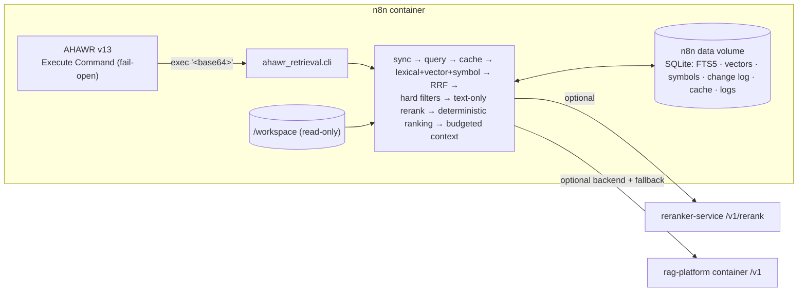

# AHAWR Retrieval Layer

**English** | [Русский](#русский)

This is the Context Retrieval Layer for AHAWR. It is a read-only component that runs **inside the n8n container**. It gives the Worker and the Reviewer relevant, current, provenance-aware context from repository code and project documentation. It never stores or restores AHAWR execution state.



## How it is deployed

- The repository `Dockerfile` installs this package into the n8n image. It needs only `pydantic`, `httpx` and `numpy`.
- `docker-compose.yml` mounts the Hermes workspace read-only at `/workspace` and keeps the index in `/home/node/.n8n/ahawr-retrieval`.
- AHAWR calls the layer through `python3 -m ahawr_retrieval.cli exec '<base64 request>'` and reads one JSON line from stdout.

Setup and the command contract are in [`docs/retrieval/INTEGRATION.md`](../docs/retrieval/INTEGRATION.md).

```bash
# local development
pip install -e ".[dev]"
export RETRIEVAL_ALLOWED_ROOTS=/path/to/workspace RETRIEVAL_DATA_DIR=./var
python -m ahawr_retrieval.cli exec '{"action":"retrieve","bootstrap":[{"corpus_id":"repo","root":"/path/to/workspace"}],"request":{"corpora":["repo"],"query":"where is the retry delay applied?"}}'
ahawr-retrieval serve --port 8500   # optional HTTP API (POST /retrieve, /index, /invalidate), needs [server]
```

## Documentation

| Topic | Document |
|---|---|
| Architecture: profiles, pipeline, freshness, cache, ranking, logging, backends | [`docs/retrieval/ARCHITECTURE.md`](../docs/retrieval/ARCHITECTURE.md) |
| n8n integration, configuration, command contract, rag-platform backend | [`docs/retrieval/INTEGRATION.md`](../docs/retrieval/INTEGRATION.md) |
| Eval Harness, datasets, metrics, decision rule | [`docs/retrieval/EVALUATION.md`](../docs/retrieval/EVALUATION.md) |
| Phases 1–6 | [`docs/retrieval/ROADMAP.md`](../docs/retrieval/ROADMAP.md) |
| AHAWR state boundary | [`ARCHITECTURE_CONTRACT.md`](../ARCHITECTURE_CONTRACT.md) §5, §9 |

## Development

```bash
ruff check src tests && ruff format --check src tests
mypy src
pytest                     # coverage gate: 80 %
```

The tests need no network access and download no models. HTTP backends (reranker, embeddings, rag-platform) are mocked with `respx`.

---

## Русский

Context Retrieval Layer для AHAWR — read-only компонент, который работает **внутри контейнера n8n**. Он даёт Worker и Reviewer релевантный, актуальный контекст из кода репозитория и документации проекта, с provenance для каждого фрагмента. Состояние выполнения AHAWR он не хранит и не восстанавливает.

- Развёртывание: пакет ставится в образ n8n (`Dockerfile`). Workspace монтируется только на чтение в `/workspace`, индекс лежит в data-томе n8n. Вызов из workflow: Execute Command `python3 -m ahawr_retrieval.cli exec '<base64>'`, в ответ одна строка JSON. Отдельного контейнера нет.
- Действия `retrieve`, `index`, `invalidate`, `health`. Тот же контракт при желании доступен как HTTP API (`ahawr-retrieval serve`).
- Профили `worker` и `reviewer`.
- Retrieval: BM25 (FTS5), векторы, поиск по символам, RRF, text-only cross-encoder (`reranker-service`), детерминированные фильтры и детерминированное ранжирование.
- У кода и документации раздельные модели версий и свежести. Content hash хранится для каждого чанка, индексация инкрементальная, инвалидация — на уровне чанков.
- Кэш с семантическим fingerprint запроса. Логи содержат признаки кандидатов для будущего LTR.
- `rag-platform` — внешний контейнер, подключаемый как бэкенд. Если он недоступен, используется локальный индекс.
- Eval Harness: `ahawr-retrieval-eval`.
