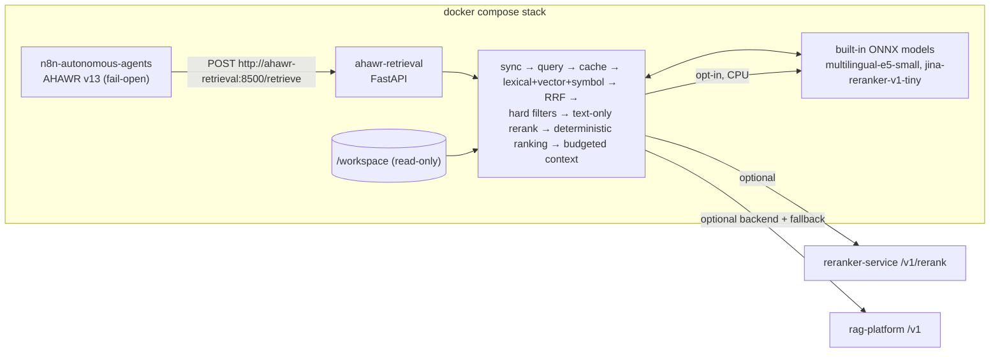

# AHAWR Retrieval Service

**English** | [Русский](#русский)

This is the Context Retrieval Layer for AHAWR. It runs as the `ahawr-retrieval` container **inside the n8n compose stack** (`../docker-compose.yml`). It gives the Worker and the Reviewer relevant, current, provenance-aware context from repository code and project documentation. It never stores or restores AHAWR execution state.



## Run

```powershell
# from the repository root
Copy-Item .env.example .env      # AHAWR_WORKSPACE_DIR, reranker/embedding URLs, optional rag-platform
docker compose up -d --build     # starts n8n and ahawr-retrieval together
```

The service is reachable only from the stack network. The workspace is mounted read-only. Corpora in `RETRIEVAL_BOOTSTRAP_CORPORA` are indexed on first request. Setup, workflow changes and the API are in [`docs/retrieval/INTEGRATION.md`](../docs/retrieval/INTEGRATION.md).

Local development without Docker:

```bash
pip install -e ".[dev]"
export RETRIEVAL_ALLOWED_ROOTS=/path/to/workspace RETRIEVAL_DATA_DIR=./var
ahawr-retrieval index my-repo --root /path/to/workspace
ahawr-retrieval retrieve --corpus my-repo --query "where is the retry delay applied?"
ahawr-retrieval serve --port 8500
```

### Retrieval request fields

* `changed_paths` — optional list of paths the Worker changed. Fragments from these paths are boosted above other fragments within the same budget; the effect is strongest for the `reviewer` profile (`changed_path_bonus = 1.5`). An absent field means identical behaviour to before. The field is a ranking/cache dimension only; it never alters the query.
* `corpus_roots` — optional `corpus_id → root` map for corpora that are not indexed yet (e.g. a mission's working directory). The corpus is indexed on first use, within `RETRIEVAL_ALLOWED_ROOTS`, with host paths mapped via `RETRIEVAL_PATH_MAP`.

### Automatic Reviewer focus

For every `reviewer` request the service collects the files the Worker changed since its last request for the same task (from the retrieval log, used as a change journal) and merges them into `changed_paths`, so the Reviewer's context is automatically focused on the Worker's changes. An explicit `changed_paths` is kept alongside the journal paths (deduplicated); with neither present the field stays absent and the request behaves as before.

### Related-test expansion

For a selected Python source file `src/.../x.py`, the context pack may add related test files into the leftover token budget: `tests/test_x.py`, `test_x_*` / `x_test` variants, the nearest `conftest.py`, and fixtures/fakes (`fake_*` modules) imported by the matched test files. Related tests are packed only after every original fragment and score below all originals, so they never displace a more relevant fragment; at most 3 related-test files are added (`RELATED_TEST_CAP`).

### Exclusions, patch demotion and notes

* `RETRIEVAL_EXCLUDE_GLOBS` — comma-separated globs (e.g. `*.bak,*.orig`) that replace the built-in backup/edit-artefact globs when non-empty; per-request and per-corpus `exclude_globs` still win over it.
* `RETRIEVAL_LARGE_PATCH_LINES` (default 1000) — a `.patch`/`.diff` fragment whose whole file is longer than the threshold is demoted (final score × 0.8) when the query does not name the file, keeping multi-thousand-line patch dumps out of the budget.
* `notes` in the response are informational, not degradations: e.g. `RETRIEVAL_RERANKER=none` is expected and reported as a note, while a stale corpus (`stale_corpus:<id>`: root no longer exists; no fragments served) is likewise an informational note, not a fault.

### `ahawr-search`

`ahawr-search "query"` is a fail-open CLI (in the claude-runner image) that POSTs `/retrieve` with the worker profile, a corpus named after the working directory and a matching `corpus_roots` entry, then prints the top fragments as `path:start-end` plus text. The default budget is 1500 tokens (`--budget 1500`). The working directory `/tmp/<X>` is resolved with `realpath` (a symlink into `/d/rag-tmp/<X>`); only `/d/` and `/workspace` roots are accepted; if the folder is not available to the service, the CLI prints `folder <resolved> is unavailable to the retrieval service` and exits 0.

```bash
ahawr-search "where is the retry delay applied?" --k 8 --budget 1500
```

On any HTTP error or timeout it prints `retrieval unavailable` and exits 0, so a Worker never blocks on a retrieval outage. The usage metric counts Bash commands whose first word is `ahawr-search` per profile.

### Usage metrics

```bash
ahawr-retrieval usage --runner-url http://localhost:8899 --since -7d
ahawr-retrieval usage --runner-url http://localhost:8899 --since -24h --profile reviewer --top 5
ahawr-retrieval usage --runner-url http://localhost:8899 --json
```

From inside the compose stack (container-to-container URL):

```bash
docker compose exec ahawr-retrieval ahawr-retrieval usage --runner-url http://claude-runner:8700 --since -24h
```

Per profile it reports selected files, opened files, precision, recall, token share and `ahawr-search` call counts, plus the most-missed files (opened but never selected) from the retrieval log joined with the claude-runner API. `--since` accepts a unix timestamp, ISO-8601 or a relative offset (`-24h`, `-7d`, `-1w`).

### Example `/retrieve` request with `changed_paths`

```json
{
  "profile": "reviewer",
  "corpora": ["ahawr-workspace"],
  "corpus_roots": {"ahawr-workspace": "/workspace"},
  "task": {"title": "…", "objective": "…"},
  "changed_paths": ["src/runner/api.py", "tests/test_api.py"],
  "budget": {"max_tokens": 5000},
  "freshness_mode": "sync"
}
```

### Live-task A/B (with and without RAG)

To compare a live task run with retrieval against the same task without it:

1. Pick a real mission and task; run it with `retrieval_enabled=true` (label `hybrid-v1`) and record: files the Worker reads (from runner events), wall-clock time, and the Reviewer's review score/decision.
2. Run the same task with `retrieval_enabled=false` (label `off`) and record the same metrics.
3. Compare: retrieval calls, context tokens, first-pass rate, retries, total task latency and review score. Keep the ordering fixed — apply RAG to the first run and no-RAG to the second (or reverse, but keep it consistent across tasks) so environment drift is not attributed to the label.

Offline, the equivalent frozen-snapshot A/B is `ahawr-retrieval-eval run` on the gold set per configuration label; see `retrieval-service/eval/results/2026-09-30-rag-usage-after.md` for a worked same-corpus example.

## Documentation

| Topic | Document |
|---|---|
| Architecture: profiles, pipeline, freshness, cache, ranking, logging, backends | [`docs/retrieval/ARCHITECTURE.md`](../docs/retrieval/ARCHITECTURE.md) |
| Stack setup, n8n integration, API, rag-platform backend, usage CLI, live-task A/B | [`docs/retrieval/INTEGRATION.md`](../docs/retrieval/INTEGRATION.md) |
| Eval Harness, datasets, metrics, decision rule, live-task A/B procedure, Worker prompt rule | [`docs/retrieval/EVALUATION.md`](../docs/retrieval/EVALUATION.md) |
| Phases 1–6 | [`docs/retrieval/ROADMAP.md`](../docs/retrieval/ROADMAP.md) |
| AHAWR state boundary | [`ARCHITECTURE_CONTRACT.md`](../ARCHITECTURE_CONTRACT.md) §5, §9 |

## Development

```bash
ruff check src tests && ruff format --check src tests
mypy src
pytest                     # coverage gate: 80 %
```

The tests need no network access and download no models. HTTP backends (reranker, embeddings, rag-platform) are mocked with `respx`, and the built-in ONNX models are replaced by fakes.

---

## Русский

Context Retrieval Layer для AHAWR работает как контейнер `ahawr-retrieval` **внутри compose-стека n8n**. Он даёт Worker и Reviewer релевантный, актуальный контекст из кода репозитория и документации проекта, с provenance для каждого фрагмента. Состояние выполнения AHAWR он не хранит и не восстанавливает.

- Запуск: `docker compose up -d --build` из корня репозитория поднимает n8n и `ahawr-retrieval` вместе. n8n обращается к сервису по адресу `http://ahawr-retrieval:8500`, наружу порт не публикуется. Workspace монтируется только на чтение, индекс хранится в отдельном томе.
- API: `POST /retrieve`, `POST /index`, `POST /invalidate`, а также `GET /corpora` и `GET /health`.
- Профили: `worker` и `reviewer`.
- Retrieval: BM25 (FTS5), векторы, поиск по символам, RRF, text-only cross-encoder (`reranker-service` или встроенная CPU-модель, `RETRIEVAL_RERANKER=local`), эмбеддинги hashing, встроенный multilingual-e5-small (`RETRIEVAL_EMBEDDER=local`) или OpenAI-совместимый endpoint, детерминированные фильтры и детерминированное ранжирование.
- Версионирование: у кода и документации раздельные модели версий и свежести. Content hash хранится для каждого чанка, индексация инкрементальная, инвалидация — на уровне чанков.
- Кэш с семантическим fingerprint запроса. Логи содержат признаки кандидатов для будущего LTR.
- `rag-platform` — внешний контейнер, подключаемый как бэкенд. Если он недоступен, используется локальный индекс.
- Eval Harness: `ahawr-retrieval-eval`.

### Поиск по требованию, фокус Reviewer'а и метрика использования

- `changed_paths` — необязательное поле запроса: пути, которые изменил Worker. Их фрагменты поднимаются выше в пределах того же бюджета, сильнее всего для профиля `reviewer` (`changed_path_bonus = 1.5`). Без поля поведение прежнее. Для запросов Reviewer'а сервис сам добавляет файлы, изменённые Worker'ом после его запроса по той же задаче (журнал изменений индекса).
- `corpus_roots` — необязательная карта `corpus_id → корень` для ещё не проиндексированных корпусов: корпус индексируется при первом запросе и инкрементально дальше. Корпус, чей корень исчез, помечается устаревшим (`stale_corpus:<id>` в `notes`) и фрагментов не выдаёт.
- Связанные тесты: к выбранному `src/.../x.py` в остаток бюджета добавляются `tests/test_x.py` и похожие, ближайший `conftest.py` и импортируемые ими `fake_*`, не больше 3 файлов и всегда после исходных фрагментов.
- Гигиена индекса: резервные копии и артефакты (`*.bak`, `*.bak-*`, `*.orig`, `*.rej`, `*~`, `*_backup*`, `*backup[0-9]*`, `*.old`) не индексируются; список заменяется переменной `RETRIEVAL_EXCLUDE_GLOBS`. Фрагменты `.patch`/`.diff` длиннее `RETRIEVAL_LARGE_PATCH_LINES` (1000 строк) понижаются (× 0.8), если запрос не называет файл.
- Намеренно выключенный реранкер (`RETRIEVAL_RERANKER=none`) — информационная пометка в `notes`, а не `degraded`; настоящие сбои эмбеддера, sync и индекса по-прежнему дают `degraded`.
- `ahawr-search "запрос" [--k N] [--budget T]` — команда в образе claude-runner для агентов: ищет по папке, из которой вызвана (`/tmp/<X>` — симлинк в `/d/rag-tmp/<X>`), бюджет по умолчанию 1500 токенов, печатает фрагменты как `path:start-end`. При любой ошибке сервиса пишет `retrieval unavailable` и завершается с кодом 0.
- Метрика использования: `docker compose exec ahawr-retrieval ahawr-retrieval usage --runner-url http://claude-runner:8700 --since -24h` — по профилям точность и полнота на уровне файлов, доля использованных токенов, вызовы `ahawr-search` и чаще всего пропущенные файлы (журнал retrieval + события claude-runner).
- A/B на живой задаче (с RAG и без) — раздел «Live-task A/B» выше и `docs/retrieval/EVALUATION.md`; пример сравнения на одном корпусе — `eval/results/2026-09-30-rag-usage-after.md`.
