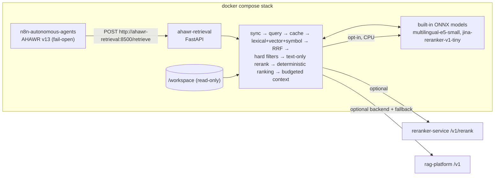

# AHAWR Retrieval Service

**English** | [Русский](#русский)

This is the Context Retrieval Layer for AHAWR. It runs as the `ahawr-retrieval` container **inside the n8n compose stack** (`../docker-compose.yml`). It gives the Worker and the Reviewer relevant, current, provenance-aware context from repository code and project documentation. It never stores or restores AHAWR execution state.



## Run

```powershell
# from the repository root
Copy-Item .env.example .env      # AHAWR_WORKSPACE_DIR, reranker/embedding URLs, optional rag-platform
docker compose up -d --build     # starts n8n and ahawr-retrieval together
```

The service is reachable only from the stack network. The workspace is mounted read-only. Corpora in `RETRIEVAL_BOOTSTRAP_CORPORA` are indexed on first request. Setup, workflow changes and the API are in [`docs/retrieval/INTEGRATION.md`](../docs/retrieval/INTEGRATION.md).

Local development without Docker:

```bash
pip install -e ".[dev]"
export RETRIEVAL_ALLOWED_ROOTS=/path/to/workspace RETRIEVAL_DATA_DIR=./var
ahawr-retrieval index my-repo --root /path/to/workspace
ahawr-retrieval retrieve --corpus my-repo --query "where is the retry delay applied?"
ahawr-retrieval serve --port 8500
```

## Documentation

| Topic | Document |
|---|---|
| Architecture: profiles, pipeline, freshness, cache, ranking, logging, backends | [`docs/retrieval/ARCHITECTURE.md`](../docs/retrieval/ARCHITECTURE.md) |
| Stack setup, n8n integration, API, rag-platform backend | [`docs/retrieval/INTEGRATION.md`](../docs/retrieval/INTEGRATION.md) |
| Eval Harness, datasets, metrics, decision rule | [`docs/retrieval/EVALUATION.md`](../docs/retrieval/EVALUATION.md) |
| Phases 1–6 | [`docs/retrieval/ROADMAP.md`](../docs/retrieval/ROADMAP.md) |
| AHAWR state boundary | [`ARCHITECTURE_CONTRACT.md`](../ARCHITECTURE_CONTRACT.md) §5, §9 |

## Development

```bash
ruff check src tests && ruff format --check src tests
mypy src
pytest                     # coverage gate: 80 %
```

The tests need no network access and download no models. HTTP backends (reranker, embeddings, rag-platform) are mocked with `respx`, and the built-in ONNX models are replaced by fakes.

---

## Русский

Context Retrieval Layer для AHAWR работает как контейнер `ahawr-retrieval` **внутри compose-стека n8n**. Он даёт Worker и Reviewer релевантный, актуальный контекст из кода репозитория и документации проекта, с provenance для каждого фрагмента. Состояние выполнения AHAWR он не хранит и не восстанавливает.

- Запуск: `docker compose up -d --build` из корня репозитория поднимает n8n и `ahawr-retrieval` вместе. n8n обращается к сервису по адресу `http://ahawr-retrieval:8500`, наружу порт не публикуется. Workspace монтируется только на чтение, индекс хранится в отдельном томе.
- API: `POST /retrieve`, `POST /index`, `POST /invalidate`, а также `GET /corpora` и `GET /health`.
- Профили: `worker` и `reviewer`.
- Retrieval: BM25 (FTS5), векторы, поиск по символам, RRF, text-only cross-encoder (`reranker-service` или встроенная CPU-модель, `RETRIEVAL_RERANKER=local`), эмбеддинги hashing, встроенный multilingual-e5-small (`RETRIEVAL_EMBEDDER=local`) или OpenAI-совместимый endpoint, детерминированные фильтры и детерминированное ранжирование.
- Версионирование: у кода и документации раздельные модели версий и свежести. Content hash хранится для каждого чанка, индексация инкрементальная, инвалидация — на уровне чанков.
- Кэш с семантическим fingerprint запроса. Логи содержат признаки кандидатов для будущего LTR.
- `rag-platform` — внешний контейнер, подключаемый как бэкенд. Если он недоступен, используется локальный индекс.
- Eval Harness: `ahawr-retrieval-eval`.
